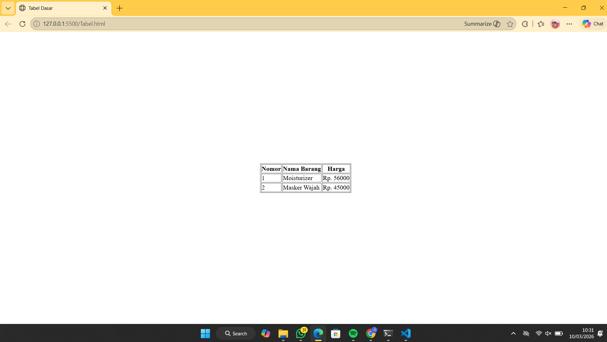

<div align="center">

# LAPORAN PRAKTIKUM
# APLIKASI BERBASIS PLATFORM


## MODUL 2
## TABEL DASAR HTML


**Disusun Oleh :**

**Sherine Naura Early Gunawan**
**23111020**
**S1 IF-11-REG01**

**PROGRAM STUDI S1 INFORMATIKA**
**FAKULTAS INFORMATIKA**
**UNIVERSITAS TELKOM PURWOKERTO**
**2025/2026**

</div>

---

## 1. Dasar Teori

HTML (HyperText Markup Language) menyediakan elemen khusus untuk menyajikan data dalam bentuk baris dan kolom yang
dikenal dengan istilah tabel. Struktur tabel pada HTML dibangun menggunakan beberapa tag hierarkis yang bekerja sama
untuk memastikan data terorganisir dengan benar. Elemen utama dimulai dengan tag "table" sebagai pembungkus seluruh
konten, diikuti oleh "tr" (Table Row) untuk mendefinisikan baris. Di dalam baris tersebut, terdapat tag "th" (Table
Header) yang digunakan untuk membuat sel judul dengan tampilan tebal dan rata tengah secara otomatis, serta tag "td"
(Table Data) untuk mengisi sel dengan data standar. Selain struktur dasar, penggunaan atribut seperti border sangat
penting untuk memunculkan garis tepi, sementara atribut align dan valign berfungsi untuk mengatur posisi konten agar
lebih presisi secara horizontal maupun vertikal di dalam halaman web.

---

## 2. Penjelasan kode

Berikut adalah implementasi kode HTML yang telah dirancang untuk menampilkan daftar harga barang menggunakan struktur
tabel dasar.
```html

<html>
<head>
    <title>Tabel</title>
</head>

<body>

    <table width="100%" height="100%">
        <tr>
            <td align="center" valign="middle">

                <table border="1">
                    <tr>
                        <th>Nomor</th>
                        <th>Nama Barang</th>
                        <th>Harga</th>
                    </tr>
                    <tr>
                        <td>1</td>
                        <td>Moisturizer</td>
                        <td>Rp. 56000</td>
                    </tr>
                    <tr>
                        <td>2</td>
                        <td>Masker Wajah</td>
                        <td>Rp. 45000</td>
                    </tr>
                </table>

            </td>
        </tr>
    </table>

</body>

</html>
```

### Penjelasan kode

Kode ini menggunakan tabel pembungkus dengan atribut width dan height sebesar 100% serta pengaturan align="center"
dan valign="middle" untuk memposisikan konten tepat di tengah layar. Di dalamnya, terdapat tabel utama beratribut
border="1" yang berfungsi menampilkan garis tepi agar data lebih terstruktur. Bagian header menggunakan tag "th" untuk
menonjolkan judul kolom, sementara data produk "Moisturizer" dan "Masker Wajah" disusun menggunakan tag "td" agar
sejajar dengan kategori yang telah ditentukan.

---

## 3. Hasil

<div align="center">
    
</div>