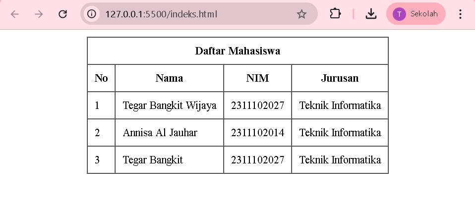

 <div align="center">

# LAPORAN PRAKTIKUM
# APLIKASI BERBASIS PLATFORM

---

## MODUL 2
## TABEL DASAR HTML

---


---

**Disusun Oleh :**

**TEGAR BANGKIT WIJAYA**

**2311102027**

**S1 IF-11-REG01**

---

**Dosen Pengampu :**

Dimas Fanny Hebrasianto Permadi, S.ST., M.Kom

---

**PROGRAM STUDI S1 INFORMATIKA**

**FAKULTAS INFORMATIKA**

**UNIVERSITAS TELKOM PURWOKERTO**

**2025/2026**

</div>

---

## 1. Dasar Teori

HTML (HyperText Markup Language) adalah bahasa markup standar yang digunakan untuk membangun struktur halaman web. HTML terdiri dari sekumpulan elemen yang direpresentasikan oleh tag-tag tertentu. Setiap tag memiliki fungsi masing-masing dalam menentukan bagaimana konten ditampilkan oleh browser.

Salah satu elemen penting dalam HTML adalah tabel. Tabel digunakan untuk menampilkan data dalam bentuk baris dan kolom yang terstruktur. Pembuatan tabel di HTML tidak memerlukan CSS sama sekali karena HTML sudah menyediakan atribut bawaan untuk mengatur tampilan tabel.

Tag-tag yang digunakan dalam pembuatan tabel HTML adalah sebagai berikut:

- `<table>` adalah tag utama yang digunakan untuk mendefinisikan sebuah tabel
- `<tr>` (table row) digunakan untuk membuat baris pada tabel
- `<th>` (table header) digunakan untuk membuat sel header yang secara default ditampilkan tebal dan rata tengah
- `<td>` (table data) digunakan untuk membuat sel data biasa

Atribut-atribut yang tersedia pada tabel HTML antara lain:

- `border` untuk menampilkan garis tepi pada tabel
- `cellpadding` untuk mengatur jarak antara konten sel dengan batas sel
- `cellspacing` untuk mengatur jarak antar sel
- `width` dan `height` untuk mengatur ukuran tabel
- `align` dan `valign` untuk mengatur posisi konten secara horizontal dan vertikal
- `colspan` untuk menggabungkan beberapa kolom menjadi satu sel

Teknik nested table yaitu menempatkan tabel di dalam tabel lain digunakan untuk memposisikan konten di tengah layar tanpa menggunakan CSS. Tabel luar berfungsi sebagai container yang memenuhi seluruh layar, sedangkan tabel dalam berisi data yang ingin ditampilkan.

---

## 2. Penjelasan Kode

Berikut adalah implementasi tabel daftar mahasiswa yang diposisikan di tengah layar menggunakan teknik nested table tanpa CSS.

### Kode HTML (index.html)
```html
<!-- 
    Nama  : Tegar Bangkit Wijaya
    NIM   : 2311102027
    Kelas : S1 IF-11-REG01
-->
<!DOCTYPE html>
<html>
<head>
    <title>Tabel Mahasiswa</title>
</head>
<body>
<table width="100%" height="100%">
    <tr>
        <td align="center" valign="middle">
            <table border="1" cellpadding="10" cellspacing="0">
                <tr>
                    <th colspan="4">Daftar Mahasiswa</th>
                </tr>
                <tr>
                    <th>No</th>
                    <th>Nama</th>
                    <th>NIM</th>
                    <th>Jurusan</th>
                </tr>
                <tr>
                    <td>1</td>
                    <td>Tegar Bangkit Wijaya</td>
                    <td>2311102027</td>
                    <td>Teknik Informatika</td>
                </tr>
                <tr>
                    <td>2</td>
                    <td>Annisa Al Jauhar</td>
                    <td>2311102014</td>
                    <td>Teknik Informatika</td>
                </tr>
                <tr>
                    <td>3</td>
                    <td>Tegar Bangkit</td>
                    <td>2311102027</td>
                    <td>Teknik Informatika</td>
                </tr>
            </table>
        </td>
    </tr>
</table>
</body>
</html>
```

### Penjelasan Kode

Tabel luar menggunakan `width="100%"` dan `height="100%"` agar memenuhi seluruh layar browser. Atribut `align="center"` dan `valign="middle"` pada tag `<td>` membuat konten di dalamnya berada tepat di tengah layar baik secara horizontal maupun vertikal.

Tabel dalam menggunakan `border="1"` untuk menampilkan garis pada tabel, `cellpadding="10"` untuk memberi jarak antara teks dengan batas sel agar lebih rapi, dan `cellspacing="0"` untuk menghilangkan jarak antar sel.

Tag `<th colspan="4">` pada baris pertama digunakan untuk membuat judul tabel yang menggabungkan 4 kolom menjadi satu sel menggunakan atribut colspan.

---

## 3. Hasil



---

<div align="center">

*2311102027 - Tegar Bangkit Wijaya - S1 IF-11-REG01*

</div>
