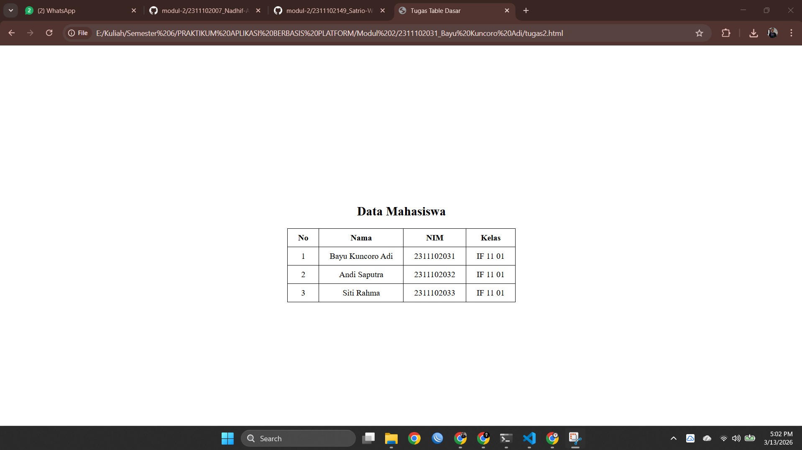

<div align="center">
  <br />
  <h1>LAPORAN PRAKTIKUM <br>APLIKASI BERBASIS PLATFORM</h1>
  <br />
  <h2>MODUL 2 <br> HTML</h2>
  <br />
  <br />
   
  <br />
  <br />
  <br />
  <h3>Disusun Oleh :</h3>
  <p>
    <strong>Bayu Kuncoro Adi</strong><br>
    <strong>2311102031</strong><br>
    <strong>S1 IF-11-REG 01</strong>
  </p>
  <br />
  <h3>Dosen Pengampu :</h3>
  <p>
    <strong>Dimas Fanny Hebrasianto Permadi, S.ST., M.Kom</strong>
  </p>
  <br />
  <br />
    <h4>Asisten Praktikum :</h4>
    <strong> Apri Pandu Wicaksono </strong> <br>
    <strong>Rangga Pradarrell Fathi</strong>
  <br />
  <h2>LABORATORIUM HIGH PERFORMANCE
 <br>FAKULTAS INFORMATIKA <br>UNIVERSITAS TELKOM PURWOKERTO <br>2026</h2>
</div>

---

# 1. Dasar Teori


### Mengenal HTML dan Struktur Dasar Tabel
HTML (HyperText Markup Language) merupakan bahasa markah utama yang digunakan untuk membangun kerangka dasar sebuah situs web. HTML bekerja dengan menggunakan sistem tag atau elemen yang tersusun secara berlapis (nested). Setiap tag memiliki fungsi tertentu untuk memberikan instruksi kepada browser mengenai bagaimana konten ditampilkan kepada pengguna, seperti menampilkan teks, gambar, maupun elemen lainnya di halaman web.

Salah satu fitur dasar yang dimiliki HTML adalah kemampuan untuk membuat tabel secara langsung tanpa harus menggunakan CSS (Cascading Style Sheets). Tabel dalam HTML biasanya digunakan untuk menampilkan data secara terstruktur dalam bentuk baris dan kolom sehingga informasi dapat dibaca dengan lebih mudah dan rapi.

Dalam pembuatan tabel HTML terdapat beberapa elemen inti yang memiliki peran masing-masing. Elemen `<table>` berfungsi sebagai wadah utama atau pembungkus dari seluruh struktur tabel. Di dalamnya terdapat elemen `<tr>` (table row) yang digunakan untuk membuat baris baru pada tabel. Selanjutnya, elemen `<th>` digunakan sebagai sel header atau judul tabel yang biasanya ditampilkan dengan teks tebal dan berada pada bagian atas tabel. Sedangkan elemen `<td>` digunakan untuk mengisi sel data pada tabel yang berisi informasi atau nilai yang ingin ditampilkan.

### Menggabungkan Sel Tabel
Selain itu, HTML juga menyediakan beberapa atribut yang memungkinkan penggabungan sel pada tabel. Penggabungan ini berguna untuk membuat tampilan tabel menjadi lebih fleksibel dan terstruktur. Salah satu atribut tersebut adalah `rowspan`, yang digunakan untuk menggabungkan beberapa baris sehingga satu sel dapat mencakup lebih dari satu baris. Atribut lainnya adalah `colspan`, yang berfungsi untuk menggabungkan beberapa kolom sehingga satu sel dapat mencakup lebih dari satu kolom dalam tabel.


### Evolusi Desain Tabel HTML
Pada versi HTML yang lebih lama, pengaturan tampilan tabel biasanya dilakukan menggunakan atribut bawaan seperti `border`, `cellpadding`, dan `cellspacing`, serta penggunaan tag `<center>` untuk menempatkan elemen di tengah halaman. Namun, dalam praktik pengembangan web modern saat ini, cara tersebut sudah mulai jarang digunakan. Pengaturan tata letak maupun tampilan visual halaman web kini lebih dianjurkan untuk dilakukan menggunakan **CSS**, karena lebih fleksibel, rapi, dan mudah untuk dikelola.

---

# 2. Penjelasan Kode HTML

Berikut ini adalah implementasi tabel berdasarkan struktur dasar HTML murni beserta hasil tampilannya.

### Kode HTML (`tugas2.html`)

```html
<!DOCTYPE html>
<html>
<head>
    <title>Tugas Table Dasar</title>

    <style>
        body{
            margin:0;
            height:100vh;
            display:flex;
            justify-content:center;
            align-items:center;
            font-family: Times New Roman;
        }

        table{
            border-collapse: collapse;
        }

        th, td{
            border:1px solid black;
            padding:8px 20px;
            text-align:center;
        }

        h2{
            text-align:center;
        }
    </style>

</head>
<body>

<div>
    <h2>Data Mahasiswa</h2>

    <table>
        <tr>
            <th>No</th>
            <th>Nama</th>
            <th>NIM</th>
            <th>Kelas</th>
        </tr>

        <tr>
            <td>1</td>
            <td>Bayu Kuncoro Adi</td>
            <td>2311102031</td>
            <td>IF 11 01</td>
        </tr>

        <tr>
            <td>2</td>
            <td>Andi Saputra</td>
            <td>2311102032</td>
            <td>IF 11 01</td>
        </tr>

        <tr>
            <td>3</td>
            <td>Siti Rahma</td>
            <td>2311102033</td>
            <td>IF 11 01</td>
        </tr>
    </table>
</div>

</body>
</html>
```

# 3. Hasil Tampilan (Screenshot)



Penjelasan Code

-Baris 1 menggunakan deklarasi <!DOCTYPE html> yang berfungsi untuk memberi tahu browser bahwa dokumen menggunakan standar HTML5.

- Baris 2 menggunakan tag <html> sebagai elemen utama yang membungkus seluruh isi dokumen HTML.

- Baris 3–4 merupakan bagian <head> yang berfungsi untuk menyimpan informasi halaman yang tidak langsung ditampilkan di layar.

- Baris 5 menggunakan tag <title> untuk memberikan judul halaman yaitu “Tugas Table Dasar” yang akan muncul pada tab browser.

- aris 7–23 menggunakan tag <style> yang berfungsi untuk menuliskan CSS (Cascading Style Sheet) guna mengatur tampilan halaman.

- Baris 8–14 mengatur tampilan elemen <body> dengan beberapa properti CSS:

    margin:0; untuk menghilangkan jarak tepi halaman.

    height:100vh; agar tinggi halaman mengikuti tinggi layar penuh.

    display:flex; untuk menggunakan Flexbox layout.

    justify-content:center; untuk memposisikan konten di tengah secara horizontal.

    align-items:center; untuk memposisikan konten di tengah secara vertikal.

    font-family: Times New Roman; untuk mengatur jenis huruf pada halaman.

- Baris 16–18 mengatur tabel menggunakan properti border-collapse: collapse; agar garis tabel menyatu dan terlihat lebih rapi.

- Baris 20–24 mengatur tampilan sel tabel <th> dan <td> dengan:

    border:1px solid black; untuk memberikan garis pada tabel.

    padding:8px 20px; untuk memberi jarak antara teks dan garis tabel.

    text-align:center; agar teks berada di tengah sel.

- Baris 26–28 mengatur tag <h2> agar judul berada di tengah menggunakan text-align:center.

- Baris 31 membuka bagian <body> yang berisi semua konten yang ditampilkan pada halaman web.

- Baris 33 menggunakan <div> sebagai wadah (container) untuk menyimpan judul dan tabel.

- Baris 34 menggunakan tag <h2> untuk menampilkan judul “Data Mahasiswa”.

- Baris 36 membuat tabel menggunakan tag <table>.

- Baris 37–42 membuat header tabel menggunakan <tr> (table row) dan <th> (table header) yang berisi kolom No, Nama, NIM, dan Kelas.

- Baris 44–48 membuat baris data pertama menggunakan <tr> dan <td> yang berisi data mahasiswa pertama.

- Baris 50–54 membuat baris data kedua yang menampilkan data mahasiswa kedua.

- Baris 56–60 membuat baris data ketiga yang menampilkan data mahasiswa ketiga.

- Baris 62–64 menutup elemen <table>, <div>, <body>, dan <html> yang menandakan akhir dari dokumen HTML.

### Refrensi

- [Materi Modul 2](https://drive.google.com/file/d/1Gcsi-U4rzqU0GC6dYTlzO7KUthrGoL8q/view?usp=sharing)