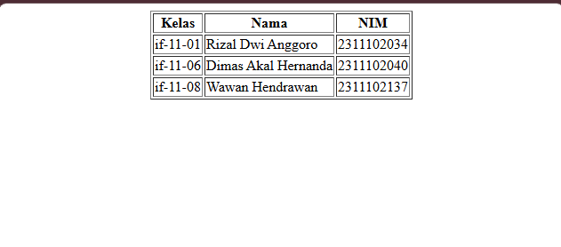

<div align="center">
  <br />
  <h1>LAPORAN PRAKTIKUM <br>APLIKASI BERBASIS PLATFORM</h1>
  <br />
  <h3>MODUL 2 <br> HTML</h3>
  <br />
   
  <br />
  <br />
  <br />
  <h3>Disusun Oleh :</h3>
  <p>
    <strong>Rizal Dwi Anggoro</strong><br>
    <strong>2311102034</strong><br>
    <strong>IF-11-REG01</strong>
  </p>
  <br />
  <h3>Dosen Pengampu :</h3>
  <p>
    <strong>Dimas Fanny Hebrasianto Permadi, S.ST., M.Kom</strong>
  </p>
  <br />
  <br />
    <h4>Asisten Praktikum :</h4>
    <strong> Apri Pandu Wicaksono </strong> <br>
    <strong>Rangga Pradarrell Fathi</strong>
  <br />
  <h3>LABORATORIUM HIGH PERFORMANCE
 <br>FAKULTAS INFORMATIKA <br>UNIVERSITAS TELKOM PURWOKERTO <br>2026</h3>
</div>

---


### DASAR TEORI :

HTML (HyperText Markup Language) merupakan bahasa markup yang digunakan untuk membuat dan menyusun struktur halaman web. HTML bekerja dengan menggunakan berbagai tag yang berfungsi untuk menentukan elemen-elemen yang akan ditampilkan pada halaman web seperti teks, gambar, tautan, maupun tabel. Setiap tag dalam HTML memiliki fungsi tertentu yang membantu dalam membangun struktur dokumen sehingga dapat ditampilkan dengan baik oleh web browser.

Salah satu elemen yang sering digunakan dalam HTML adalah tabel. Tabel digunakan untuk menampilkan data secara terstruktur dalam bentuk baris dan kolom. Elemen tabel dalam HTML dibuat menggunakan tag &lt;table&gt;. Di dalam tag tersebut terdapat beberapa tag lain seperti &lt;tr&gt; (table row) yang berfungsi untuk membuat baris, &lt;th&gt; (table header) yang digunakan sebagai judul kolom tabel, serta &lt;td&gt; (table data) yang digunakan untuk menampilkan isi data pada tabel. Dengan menggunakan elemen-elemen tersebut, informasi dapat disusun dengan lebih rapi dan mudah dipahami oleh pengguna.

Selain itu, HTML juga menyediakan atribut tambahan pada tabel, salah satunya adalah atribut border yang digunakan untuk menampilkan garis pada tabel sehingga struktur baris dan kolom dapat terlihat dengan jelas. Dalam pengembangan web modern, pengaturan tampilan biasanya menggunakan CSS, namun pada HTML dasar atribut seperti border, align, dan valign masih dapat digunakan untuk mengatur tampilan sederhana tanpa menggunakan styling tambahan.

Melalui penggunaan tabel dalam HTML, data seperti daftar nama, kelas, atau nomor induk mahasiswa dapat disajikan secara terstruktur. Oleh karena itu, pemahaman mengenai elemen tabel dalam HTML menjadi dasar penting dalam pembuatan halaman web sederhana.


### UNGUIDED:

**Code :**

```html
<!DOCTYPE html>
<html lang="en">
<head>
    <title>TABEL DASAR</title>
</head>
<body>                                  
    <center>
    <table border="1">
        <tr>
            <th>Kelas</th>
            <th>Nama</th>
            <th>NIM</th>
        </tr>
        <tr>
            <td>if-11-01</td>
            <td>Rizal Dwi Anggoro</td> /* RIZAL DWI ANGGORO */
            <td>2311102034</td>
        </tr>
        <tr>
            <td>if-11-06</td>
            <td>Dimas Akal Hernanda</td>
            <td>2311102040</td>
        </tr>
        <tr>
            <td>if-11-08</td>
            <td>Wawan Hendrawan</td>
            <td>2311102137</td>
        </tr>
    </table>
    </center>
</body>                             
</html>
```




**Penjelasan**

Kode HTML yang menampilkan sebuah tabel berisi data kelas, nama, dan NIM. Baris &lt;!DOCTYPE html&gt; berfungsi untuk memberi tahu browser bahwa dokumen menggunakan HTML5. Tag &lt;html&gt; merupakan tag utama yang membungkus seluruh isi halaman, sedangkan bagian &lt;head&gt; berisi informasi halaman seperti judul yang ditampilkan pada tab browser melalui tag &lt;title&gt;. Selanjutnya pada bagian &lt;body&gt; terdapat isi utama halaman yang akan ditampilkan. Tag &lt;center&gt; digunakan untuk membuat tabel berada di tengah halaman secara horizontal. Tabel dibuat menggunakan tag &lt;table&gt; dengan atribut border="1" agar tabel memiliki garis pembatas. Di dalam tabel terdapat tag &lt;tr&gt; untuk membuat baris, &lt;th&gt; untuk membuat judul kolom seperti Kelas, Nama, dan NIM, serta &lt;td&gt; untuk menampilkan data pada setiap kolom tabel. Dengan menggunakan struktur tag tersebut, data dapat ditampilkan secara rapi dalam bentuk tabel sehingga lebih mudah dibaca dan dipahami.


