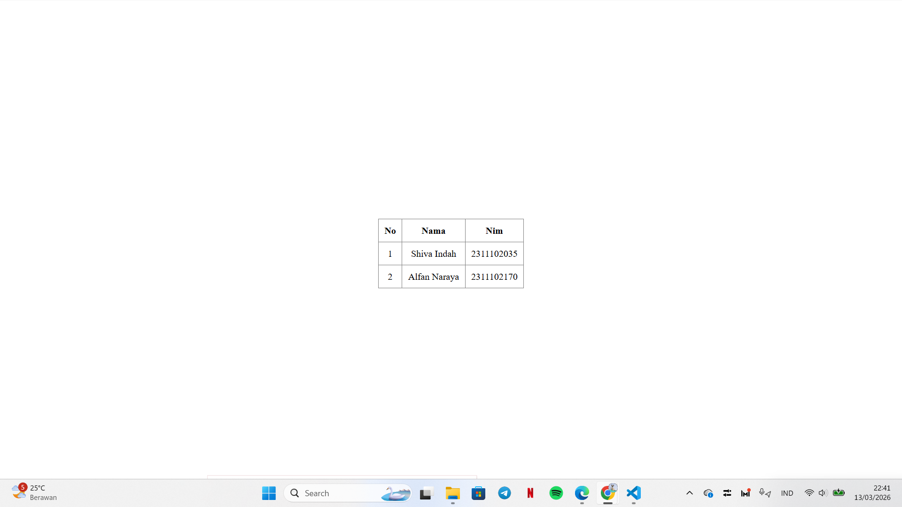

<div align="center">
  <br />
  <h1>LAPORAN PRAKTIKUM <br>APLIKASI BERBASIS PLATFORM</h1>
  <br />
  <h3>MODUL 2 <br> HTML</h3>
  <br />
  <br />
   
  <br />
  <br />
  <br />
  <h3>Disusun Oleh :</h3>
  <p>
    <strong>Shiva Indah Kurnia</strong><br>
    <strong>2311102035</strong><br>
    <strong>S1 IF-11-01</strong>
  </p>
  <br />
  <h3>Dosen Pengampu :</h3>
  <p>
    <strong>Dimas Fanny Hebrasianto Permadi, S.ST., M.Kom</strong>
  </p>
  <br />
  <br />
    <h4>Asisten Praktikum :</h4>
    <strong> Apri Pandu Wicaksono </strong> <br>
    <strong>Rangga Pradarrell Fathi</strong>
  <br />
  <h3>LABORATORIUM HIGH PERFORMANCE
 <br>FAKULTAS INFORMATIKA <br>UNIVERSITAS TELKOM PURWOKERTO <br>2026</h3>
</div>

---

## 1. Dasar Teori

HTML (HyperText Markup Language) merupakan bahasa markah standar yang digunakan untuk membangun struktur dasar sebuah halaman web. HTML bekerja dengan menggunakan kumpulan tag atau elemen yang tersusun secara bertingkat (*nested elements*). Tag tersebut memberikan instruksi kepada *web browser* mengenai bagaimana konten seperti teks, gambar, maupun elemen lainnya ditampilkan pada halaman web.

Salah satu fitur yang tersedia pada HTML adalah pembuatan tabel. Tabel dapat dibuat langsung menggunakan elemen HTML tanpa harus menggunakan bantuan CSS (Cascading Style Sheets). Dalam struktur tabel HTML terdapat beberapa elemen utama, antara lain:

- `<table>` digunakan sebagai pembungkus utama tabel
- `<tr>` digunakan untuk menandai baris tabel
- `<th>` digunakan sebagai sel header tabel
- `<td>` digunakan sebagai sel data tabel

Selain itu, HTML juga menyediakan beberapa atribut yang memungkinkan penggabungan sel dalam tabel, yaitu:

- `rowspan` digunakan untuk menggabungkan beberapa baris
- `colspan` digunakan untuk menggabungkan beberapa kolom

Pada HTML versi lama juga terdapat beberapa atribut presentasi seperti `border`, `cellpadding`, dan `cellspacing` yang digunakan untuk mengatur tampilan tabel secara langsung. Selain itu, tag `<center>` dapat digunakan untuk menempatkan elemen pada posisi tengah halaman. Namun pada pengembangan web modern, pengaturan tampilan biasanya dilakukan menggunakan CSS.

---

## 2. Penjelasan Kode HTML

Berikut ini adalah implementasi tabel berdasarkan struktur dasar HTML murni beserta hasil tampilannya.

### Kode HTML (`table.html`)

```html
<!DOCTYPE html>
<html lang="id">
<head>
    <meta charset="UTF-8">
    <title>Tabel</title>
</head>
<body style="margin: 0; height: 100vh; display: table; width: 100%;">

    <div style="display: table-cell; vertical-align: middle; text-align: center;">

        <table border="1" cellpadding="10" cellspacing="0" style="margin-left: auto; margin-right: auto; border-collapse: collapse;">
            <thead>
                <tr>
                    <th>No</th>
                    <th>Nama</th>
                    <th>Nim</th>
                </tr>
            </thead>
            <tbody>
                <tr>
                    <td>1</td>
                    <td>Shiva Indah</td>
                    <td>2311102035</td>
                </tr>
                <tr>
                    <td>2</td>
                    <td>Alfan Naraya</td>
                    <td>2311102170</td>
                </tr>
            </tbody>
        </table>

    </div>
</body>
</html>
```

### Hasil Tampilan (Screenshot)



### Penjelasan Code

1. Baris 8, browser memberikan jarak (margin) di pinggir layar. Baris ini memaksa semua jarak itu menjadi nol agar tabel pembungkus bisa benar-benar "menempel" ke empat sisi ujung layar monitor.
2. Baris 11, Baris ini membuat tabel tak terlihat yang ukurannya dipaksa seluas layar (lebar 100% dan tinggi 100%). Tabel ini berfungsi sebagai "panggung" untuk meletakkan tabel utama.
3. Baris 15, berfungsi mendorong tabel ke tengah secara horizontal (kiri-kanan), juga mendorong tabel ke tengah secara vertikal (atas-bawah).
4. Baris 19 - 38, Di baris-baris ini tabel yang ingin ditampilkan dibuat. Karena dia berada di dalam sel yang sudah disetel ke tengah (pada baris 15), maka tabel ini otomatis akan muncul di tengah-tengah layar tanpa perlu diperintah lagi.
5. Baris 41 - 44, Menutup semua elemen pembungkus tadi secara berurutan agar struktur HTML tetap valid dan tidak berantakan.

## Refrensi

- [Materi Modul 2](https://drive.google.com/file/d/1Gcsi-U4rzqU0GC6dYTlzO7KUthrGoL8q/view?usp=sharing)
