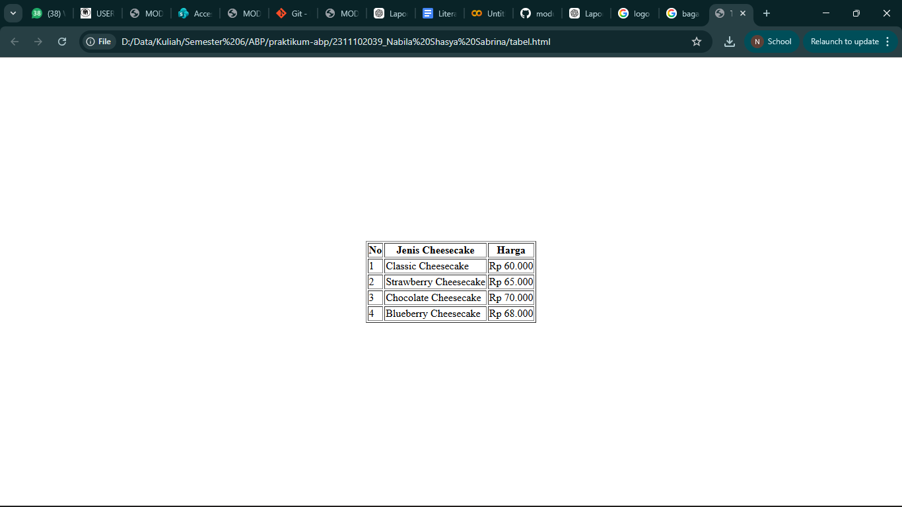

<div align="center">

<br />
  <h1>LAPORAN PRAKTIKUM <br>APLIKASI BERBASIS PLATFORM</h1>
  <br />
  <h3>MODUL 2 <br> HTML</h3>
  <br />
  <br />
   
  <br />
  <br />
  <br />
  <h3>Disusun Oleh :</h3>
  <p>
    <strong>Nabila Shasya Sabrina</strong><br>
    <strong>2311102039</strong><br>
    <strong>S1 IF-11-01</strong>
  </p>
  <br />
  <h3>Dosen Pengampu :</h3>
  <p>
    <strong>Dimas Fanny Hebrasianto Permadi, S.ST., M.Kom</strong>
  </p>
  <br />
  <br />
    <h4>Asisten Praktikum :</h4>
    <strong> Apri Pandu Wicaksono </strong> <br>
    <strong>Rangga Pradarrell Fathi</strong>
  <br />
  <h3>LABORATORIUM HIGH PERFORMANCE
 <br>FAKULTAS INFORMATIKA <br>UNIVERSITAS TELKOM PURWOKERTO <br>2026</h3>
</div>

---


</div>


---


## 1. Dasar Teori

HTML (HyperText Markup Language) menyediakan elemen khusus untuk menyajikan data dalam bentuk baris dan kolom yang dikenal dengan istilah tabel. Struktur tabel pada HTML dibangun menggunakan beberapa tag hierarkis yang bekerja sama untuk memastikan data terorganisir dengan benar. Elemen utama dimulai dengan tag "table" sebagai pembungkus seluruh konten, diikuti oleh "tr" (Table Row) untuk mendefinisikan baris. Di dalam baris tersebut, terdapat tag "th" (Table Header) yang digunakan untuk membuat sel judul dengan tampilan tebal dan rata tengah secara otomatis, serta tag "td" (Table Data) untuk mengisi sel dengan data standar. Selain struktur dasar, penggunaan atribut seperti border sangat penting untuk memunculkan garis tepi, sementara atribut align dan valign berfungsi untuk mengatur posisi konten agar lebih presisi secara horizontal maupun vertikal di dalam halaman web.

---

## 2. Penjelasan kode

Berikut adalah implementasi kode HTML yang telah dirancang untuk menampilkan daftar harga barang menggunakan struktur tabel dasar.

```html

<html>
<head>
&nbsp;   <title>Tabel Cheesecake</title>
</head>
<body>
<table width="100%" height="100%">
<tr>
<td align="center" valign="middle">
<table border="1">
<tr>
<th>No</th>
<th>Jenis Cheesecake</th>
<th>Harga</th>
</tr>
<tr>
<td>1</td>
<td>Classic Cheesecake</td>
<td>Rp 60.000</td>
</tr>
<tr>
<td>2</td>
<td>Strawberry Cheesecake</td>
<td>Rp 65.000</td>
</tr>
<tr>
<td>3</td>
<td>Chocolate Cheesecake</td>
<td>Rp 70.000</td>
</tr>
<tr>
<td>4</td>
<td>Blueberry Cheesecake</td>
<td>Rp 68.000</td>
</tr>
</table>
</td>
</tr>
</table>
</body>
</html>

```
### Penjelasan kode

Kode HTML di atas menggunakan sebuah tabel pembungkus dengan atribut width="100%" dan height="100%" yang berfungsi untuk memposisikan konten di bagian tengah halaman. Atribut align="center" dan valign="middle" digunakan agar tabel utama berada tepat di tengah layar.

Di dalam tabel pembungkus tersebut terdapat tabel utama dengan atribut border="1" yang berfungsi untuk menampilkan garis tepi pada setiap sel. Baris pertama menggunakan tag <th> sebagai judul kolom yang terdiri dari nomor, jenis cheesecake, dan harga. Selanjutnya data menu seperti Classic Cheesecake, Strawberry Cheesecake, Chocolate Cheesecake, dan Blueberry Cheesecake ditampilkan menggunakan tag <td> sehingga informasi dapat tersusun rapi sesuai dengan kolomnya masing-masing.

---

## 3. Hasil
<div align="center">

&nbsp;   

</div>

