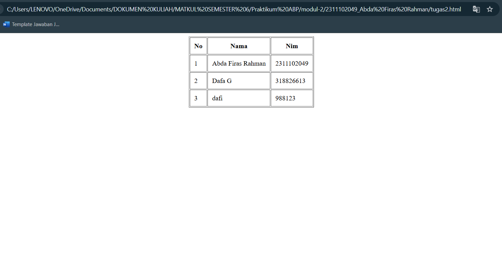

<div align="center">
  <br />

  <h1>LAPORAN PRAKTIKUM <br>
  APLIKASI BERBASIS PLATFORM
  </h1>

  <br />

  <h3>MODUL I <br>
  GIT
  </h3>

  <br />

  <p align="center">

</p>

  <br />
  <br />
  <br />

  <h3>Disusun Oleh :</h3>

  <p>
    <strong>Abda Firas Rahman</strong><br>
    <strong>2311102049</strong><br>
    <strong>S1 IF-11-01</strong>
  </p>

  <br />

  <h3>Dosen Pengampu :</h3>

  <p>
    <strong>Dimas Fanny Hebrasianto Permadi, S.ST., M.Kom</strong>
  </p>
  
  <br />
  <br />
    <h4>Asisten Praktikum :</h4>
    <strong>Apri Pandu Wicaksono </strong> <br>
    <strong>Rangga Pradarrell Fathi</strong>
  <br />

  <h3>LABORATORIUM HIGH PERFORMANCE
 <br>FAKULTAS INFORMATIKA <br>UNIVERSITAS TELKOM PURWOKERTO <br>2026</h3>
</div>

<hr>

## Dasar Teori

HTML (*HyperText Markup Language*) merupakan bahasa markah standar web yang digunakan untuk membuat dan menyusun struktur sebuah halaman website. HTML bekerja menggunakan sederet tag bersarang (*nested element*) untuk memberi tahu *web browser* bagaimana cara menampilkan elemen teks, gambar, maupun layout secara keseluruhan di layar. Dalam pembuatan struktur tabel murni yang memanfaatkan HTML (tanpa bantuan dari *Cascading Style Sheets* atau CSS), kita dapat menggunakan format elemen `<table>` dan didukung oleh tag `<tr>` untuk baris, `<th>` untuk header tabel, serta `<td>` untuk sel data tabel.

Selain struktur dasar, HTML juga menyediakan atribut seperti `rowspan` untuk menggabungkan baris dan `colspan` untuk menggabungkan kolom. Atribut lain yang sering digunakan pada sisi presentasi (meskipun format ini lebih tua atau *legacy*) meliputi tag `<center>` untuk meratakan konten tepat di tengah layar, serta atribut `border`, `cellpadding`, dan `cellspacing` pada tag `<table>` yang berfungsi untuk mengatur spasi antar sel serta ketebalan garis batas tabel secara langsung.

## Kode program HTML
Berikut adalah kode nya:

```html
<!DOCTYPE html>
<html>
<head>
<title>Tabel Mahasiswa</title>
</head>
<body>

<center>
<table border="1" cellpadding="10">
<tr>
<th>No</th>
<th>Nama</th>
<th>NIM</th>
</tr>

<tr>
<td>1</td>
<td>Abda Firas Rahman</td>
<td>2311102049</td>
</tr>

<tr>
<td>2</td>
<td>Dafa G</td>
<td>2311102050</td>
</tr>

</table>
</center>

</body>
</html>
```

## Tampilan ss


## Penjelasan Kode

Kode di atas merupakan implementasi struktur tabel menggunakan sintaks HTML tanpa menggunakan *styling* eksternal maupun internal. Tabel ditempatkan di tengah halaman menggunakan tag `<center>` agar seluruh elemen tabel berada di tengah layar secara horizontal.

Tag `<table>` menggunakan atribut `border="1"` untuk menampilkan garis pembatas pada setiap sel dan `cellpadding="10"` untuk memberikan ruang antara teks dengan tepi garis sehingga tampilan data menjadi lebih rapi dan mudah dibaca.

Struktur tabel dibagi menjadi beberapa baris menggunakan tag `<tr>`. Baris pertama menggunakan tag `<th>` sebagai *header* tabel untuk kolom No, Nama, dan NIM sehingga teks tampil lebih tebal secara otomatis.

Baris berikutnya menggunakan tag `<td>` untuk menampilkan data mahasiswa, yaitu Abda Firas Rahman, Dafa G, dan Dafi beserta NIM masing-masing. Seluruh tampilan pada tabel ini sepenuhnya mengandalkan atribut bawaan HTML sesuai dengan batasan tugas yang diberikan.
