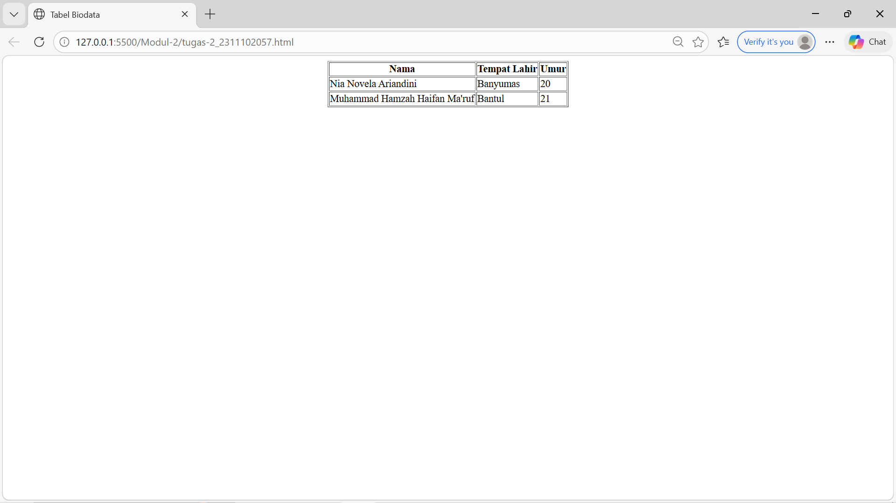

<div align="center">
  <br />
  <h1>LAPORAN PRAKTIKUM <br>APLIKASI BERBASIS PLATFORM</h1>
  <br />
  <h3>MODUL 2 <br> GIT</h3>
  <br />
   
  <br />
  <br />
  <br />
  <h3>Disusun Oleh :</h3>
  <p>
    <strong>Nia Novela Ariandini</strong><br>
    <strong>2311102057</strong><br>
    <strong>S1 IF-11-01</strong>
  </p>
  <br />
  <h3>Dosen Pengampu :</h3>
  <p>
    <strong>Dimas Fanny Hebrasianto Permadi, S.ST., M.Kom</strong>
  </p>
  <br />
  <br />
    <h4>Asisten Praktikum :</h4>
    <strong> Apri Pandu Wicaksono </strong> <br>
    <strong>Rangga Pradarrell Fathi</strong>
  <br />
  <br />
  <br />
  <br />
  <h3>LABORATORIUM HIGH PERFORMANCE
 <br>FAKULTAS INFORMATIKA <br>UNIVERSITAS TELKOM PURWOKERTO <br>2026</h3>
</div>

---

## 1. Dasar Teori

HTML (*HyperText Markup Language*) merupakan bahasa dasar yang digunakan untuk membuat struktur halaman web. HTML bekerja menggunakan berbagai tag yang saling terhubung dan tersusun secara bertingkat. Setiap tag memiliki fungsi tertentu untuk menampilkan elemen seperti teks, gambar, tabel, dan lain-lain di dalam halaman web.

Salah satu elemen yang cukup sering digunakan dalam HTML adalah **tabel**. Tabel biasanya digunakan untuk menampilkan data yang berbentuk baris dan kolom sehingga informasi bisa dibaca dengan lebih rapi dan terstruktur.

Dalam HTML, pembuatan tabel bisa dilakukan hanya dengan menggunakan tag bawaan tanpa harus menggunakan CSS. 
Beberapa tag utama yang digunakan dalam pembuatan tabel yaitu :
- `<table>` digunakan sebagai pembungkus utama tabel  
- `<tr>` digunakan untuk membuat baris pada tabel  
- `<th>` digunakan untuk membuat header tabel  
- `<td>` digunakan untuk menampilkan isi atau data tabel  

Selain itu, HTML juga memiliki beberapa atribut tambahan yang bisa digunakan untuk mengatur tampilan tabel seperti `border`, `cellpadding`, dan `cellspacing`. Namun pada praktikum ini tabel dibuat sederhana tanpa menggunakan CSS atau styling tambahan.

Untuk menempatkan tabel agar berada di tengah halaman, HTML lama menyediakan tag `<center>`. Tag ini dapat digunakan untuk membuat elemen yang ada di dalamnya ditampilkan tepat di tengah layar browser.

---

## 2. Penjelasan Kode HTML

Pada praktikum modul ini dibuat sebuah tabel sederhana yang berisi data biodata. Tabel memiliki tiga kolom yaitu **Nama**, **Tempat Lahir**, dan **Umur**. Tabel harus ditampilkan di tengah halaman dan tidak boleh menggunakan CSS ataupun styling tambahan.

### Kode HTML (`tugas-2_2311102057.html`)

```html
<!DOCTYPE html>
<html>

<head>
    <title>Tabel Biodata</title>
</head>

<body>

    <center>

        <table border="1">

            <tr>
                <th>Nama</th>
                <th>Tempat Lahir</th>
                <th>Umur</th>
            </tr>

            <tr>
                <td>Nia Novela Ariandini</td>
                <td>Banyumas</td>
                <td>20</td>
            </tr>

            <tr>
                <td>Muhammad Hamzah Haifan Ma'ruf</td>
                <td>Bantul</td>
                <td>21</td>
            </tr>

        </table>

    </center>

</body>

</html>
```
### Hasil Tampilan (Screenshot)



## Penjelasan Code

Pada bagian paling atas terdapat deklarasi `<!DOCTYPE html>` yang 
menandakan bahwa dokumen menggunakan standar HTML.

Tag `<html>` berfungsi sebagai pembungkus utama seluruh isi halaman web.

Bagian `<head>` berisi informasi tentang halaman, salah satunya adalah 
tag `<title>` yang digunakan untuk memberikan judul pada halaman ketika 
dibuka di browser.

Bagian `<body>` merupakan tempat semua konten yang akan ditampilkan 
pada halaman web.

Tag `<center>` digunakan untuk menempatkan tabel agar berada tepat 
di tengah halaman. Dengan menggunakan tag ini, tabel langsung berada 
di posisi tengah tanpa perlu menggunakan CSS.

Tag `<table>` digunakan untuk membuat struktur tabel. Pada tabel tersebut 
ditambahkan atribut `border="1"` agar garis tabel terlihat ketika 
ditampilkan di browser.

Tag `<tr>` digunakan untuk membuat baris pada tabel.

Tag `<th>` digunakan sebagai header tabel yang berisi judul kolom yaitu 
Nama, Tempat Lahir, dan Umur.

Tag `<td>` digunakan untuk menampilkan isi data tabel. Pada contoh ini 
terdapat dua baris data yaitu **Nia Novela Ariandini** yang lahir di 
**Banyumas** dengan umur **20 tahun**, serta **Muhammad Hamzah Haifan 
Ma'ruf** yang lahir di **Bantul** dengan umur **21 tahun**.

Dengan struktur HTML sederhana tersebut, tabel sudah dapat ditampilkan 
dengan rapi di tengah halaman tanpa menggunakan CSS ataupun styling 
tambahan.

## Referensi
- [Materi Modul 2](https://drive.google.com/file/d/1Gcsi-U4rzqU0GC6dYTlzO7KUthrGoL8q/view?usp=sharing)