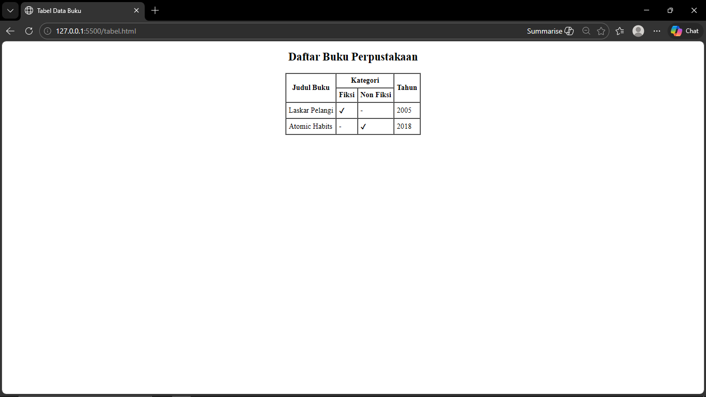

<div align="center">
  <br />
  <h1>LAPORAN PRAKTIKUM <br>APLIKASI BERBASIS PLATFORM</h1>
  <br />
  <h3>MODUL 2 <br> HTML</h3>
  <br />
  <br />
   
  <br />
  <br />
  <br />
  <h3>Disusun Oleh :</h3>
  <p>
    <strong>Muhammad Hamzah Haifan Ma'ruf</strong><br>
    <strong>2311102091</strong><br>
    <strong>S1 IF-11-01</strong>
  </p>
  <br />
  <h3>Dosen Pengampu :</h3>
  <p>
    <strong>Dimas Fanny Hebrasianto Permadi, S.ST., M.Kom</strong>
  </p>
  <br />
  <br />
    <h4>Asisten Praktikum :</h4>
    <strong> Apri Pandu Wicaksono </strong> <br>
    <strong>Rangga Pradarrell Fathi</strong>
  <br />
  <h3>LABORATORIUM HIGH PERFORMANCE
 <br>FAKULTAS INFORMATIKA <br>UNIVERSITAS TELKOM PURWOKERTO <br>2026</h3>
</div>

---

## 1. Dasar Teori

HTML (HyperText Markup Language) adalah bahasa markah yang digunakan untuk menyusun struktur dasar sebuah halaman web. HTML bekerja dengan menggunakan berbagai tag atau elemen yang tersusun secara bertingkat (*nested*) untuk mengatur bagaimana suatu konten ditampilkan oleh browser. Dengan HTML, berbagai jenis konten seperti teks, gambar, tabel, maupun tautan dapat disusun dengan rapi dalam sebuah halaman web.

Salah satu elemen yang dapat dibuat menggunakan HTML adalah tabel. Tabel digunakan untuk menampilkan data dalam bentuk baris dan kolom sehingga informasi dapat tersusun secara terstruktur dan mudah dibaca. Pembuatan tabel dasar dapat dilakukan langsung menggunakan elemen HTML tanpa memerlukan bantuan CSS.

Beberapa elemen utama yang digunakan dalam pembuatan tabel HTML antara lain:

- `<table>` digunakan sebagai elemen utama pembungkus tabel
- `<tr>` digunakan untuk membuat baris pada tabel
- `<th>` digunakan sebagai sel judul atau header tabel
- `<td>` digunakan sebagai sel yang berisi data tabel

HTML juga menyediakan atribut yang memungkinkan penggabungan beberapa sel dalam tabel, yaitu:

- `rowspan` digunakan untuk menggabungkan beberapa baris dalam satu sel
- `colspan` digunakan untuk menggabungkan beberapa kolom dalam satu sel

Selain itu, pada HTML dasar terdapat beberapa atribut presentasi seperti `border`, `cellpadding`, dan `cellspacing` yang digunakan untuk mengatur tampilan tabel secara langsung. Tag `<center>` juga dapat digunakan untuk menempatkan elemen di bagian tengah halaman. Walaupun pada pengembangan web modern tampilan biasanya diatur menggunakan CSS, atribut tersebut masih sering digunakan untuk mempelajari konsep dasar HTML.

---

## 2. Penjelasan Kode HTML

Berikut merupakan contoh implementasi tabel dasar menggunakan HTML.

### Kode HTML (`table.html`)

```html
<!DOCTYPE html>
<html>
<head>
    <title>Tabel Data Buku</title>
</head>
<body>

<center>

<h2>Daftar Buku Perpustakaan</h2>

<table border="1" cellpadding="5" cellspacing="0">
    <tr>
        <th rowspan="2">Judul Buku</th>
        <th colspan="2">Kategori</th>
        <th rowspan="2">Tahun</th>
    </tr>
    <tr>
        <th>Fiksi</th>
        <th>Non Fiksi</th>
    </tr>
    <tr>
        <td>Laskar Pelangi</td>
        <td>✔</td>
        <td>-</td>
        <td>2005</td>
    </tr>
    <tr>
        <td>Atomic Habits</td>
        <td>-</td>
        <td>✔</td>
        <td>2018</td>
    </tr>
</table>

</center>

</body>
</html>
```

### Hasil Tampilan (Screenshot)



### Penjelasan Code

- **Baris 1–5** merupakan struktur awal dokumen HTML yang diawali dengan deklarasi `<!DOCTYPE html>` kemudian diikuti dengan tag `<html>` dan `<head>`. Pada bagian ini terdapat tag `<title>` yang berfungsi untuk menampilkan judul halaman pada tab browser.

- **Baris 7–9** membuka bagian `<body>` dan menggunakan tag `<center>` untuk menempatkan seluruh elemen halaman berada di tengah.

- **Baris 11** menggunakan tag `<h2>` untuk menampilkan judul halaman yaitu **Daftar Buku Perpustakaan**.

- **Baris 13** merupakan pembuka tabel dengan atribut `border="1"`, `cellpadding="5"`, dan `cellspacing="0"`.  
  - `border` digunakan untuk menampilkan garis batas tabel.  
  - `cellpadding` memberikan jarak antara isi sel dan garis tabel.  
  - `cellspacing` digunakan untuk mengatur jarak antar sel.

- **Baris 14–19** merupakan bagian header tabel yang menggunakan elemen `<th>`.  
  - `rowspan="2"` pada kolom **Judul Buku** dan **Tahun** membuat sel tersebut memanjang hingga dua baris.  
  - `colspan="2"` pada bagian **Kategori** digunakan untuk menggabungkan dua kolom yang kemudian dibagi menjadi **Fiksi** dan **Non Fiksi** pada baris berikutnya.

- **Baris 20–31** merupakan isi tabel yang dituliskan menggunakan elemen `<td>`. Setiap baris data dibungkus dengan tag `<tr>` yang menandakan satu baris dalam tabel.

- **Baris 33–37** menutup seluruh elemen HTML yang sebelumnya dibuka yaitu `<table>`, `<center>`, `<body>`, dan `<html>`.

## Refrensi

- [Materi Modul 2](https://drive.google.com/file/d/1Gcsi-U4rzqU0GC6dYTlzO7KUthrGoL8q/view?usp=sharing)