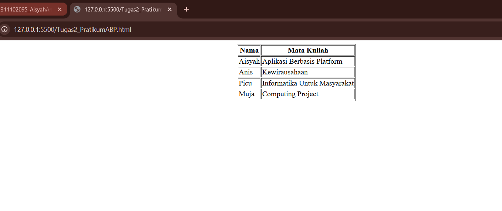

<div align="center">
  <br />

  <h1>LAPORAN PRAKTIKUM <br>
  APLIKASI BERBASIS PLATFORM
  </h1>

  <br />

  <h3>MODUL 2 <br>
  HTML
  </h3>

  <br />

  <p align="center">

</p>

  <br />
  <br />
  <br />

  <h3>Disusun Oleh :</h3>

  <p>
    <strong>Aisyah Anis Mazaya</strong><br>
    <strong>2311102095</strong><br>
    <strong>S1 IF-11-REG01</strong>
  </p>

  <br />

  <h3>Dosen Pengampu :</h3>

  <p>
    <strong>Dimas Fanny Hebrasianto Permadi, S.ST., M.Kom</strong>
  </p>
  
  <br />
  <br />
    <h4>Asisten Praktikum :</h4>
    <strong>Apri Pandu Wicaksono </strong> <br>
    <strong>Rangga Pradarrell Fathi</strong>
  <br />

  <h3>LABORATORIUM HIGH PERFORMANCE
 <br>FAKULTAS INFORMATIKA <br>UNIVERSITAS TELKOM PURWOKERTO <br>2026</h3>
</div>

<hr>

## Dasar Teori

HTML (*HyperText Markup Language*) merupakan fondasi utama dalam merancang kerangka serta struktur sebuah situs web. Dengan memanfaatkan sistem elemen bersarang (*nested elements*), bahasa ini memberikan instruksi mendetail kepada peramban (*browser*) mengenai cara menampilkan konten mulai dari teks dan gambar hingga pengaturan tata letak secara menyeluruh. Untuk membangun sebuah tabel secara konvensional tanpa bantuan CSS, pengembang web menggunakan tag `<table>` yang didukung oleh elemen `<tr>` untuk mendefinisikan baris `<th>` untuk bagian kepala tabel, serta `<td>` untuk mengisi data pada setiap selnya.

Selain struktur dasar tersebut terdapat atribut `rowspan` dan `colspan` yang memungkinkan penggabungan baris atau kolom agar tampilan data lebih fleksibel. Meskipun kini sudah dianggap sebagai metode lama (*legacy*) HTML juga memiliki atribut presentasi langsung seperti `border` untuk mengatur garis tepi serta `cellpadding` dan `cellspacing` untuk memodifikasi jarak spasi di dalam maupun antar sel. Selain itu terdapat pula tag `<center>` yang secara tradisional digunakan untuk memosisikan elemen tepat di tengah halaman web.

## Kode program HTML
Code html nya:

```html
<table border="1" align="center">
    <tr>
        <th>Nama</th>
        <th>Mata Kuliah</th>
    </tr>
    <!-- 2311102095 - Aisyah Anis Mazaya - Modul_2 -->
    <tr>
        <td>Aisyah</td>
        <td>Aplikasi Berbasis Platform</td>
    </tr>
    <tr>
        <td>Anis</td>
        <td>Kewirausahaan</td>
    </tr>
    <tr>
        <td>Picu</td>
        <td>Informatika Untuk Masyarakat</td>
    </tr>
    <tr>
        <td>Muja</td>
        <td>Computing Project</td>
    </tr>
    <tr>
</table>
```

## Tampilan ss


## Penjelasan Kode

Kode di atas merupakan implementasi pembuatan tabel menggunakan sintaks HTML. 
Tabel dibuat menggunakan tag `<table>` dengan atribut `border="1"` untuk menampilkan garis pembatas pada setiap sel, serta atribut `align="center"` yang berfungsi untuk menempatkan tabel di tengah halaman secara horizontal.

Struktur tabel dibagi menjadi beberapa baris menggunakan tag `<tr>`. Baris pertama menggunakan tag `<th>` sebagai header tabel yang berisi judul kolom **Nama** dan **Mata Kuliah**.

Baris berikutnya menggunakan tag `<td>` untuk menampilkan data mahasiswa, yaitu Aisyah, Anis, Picu, dan Muja beserta mata kuliah yang mereka ambil.