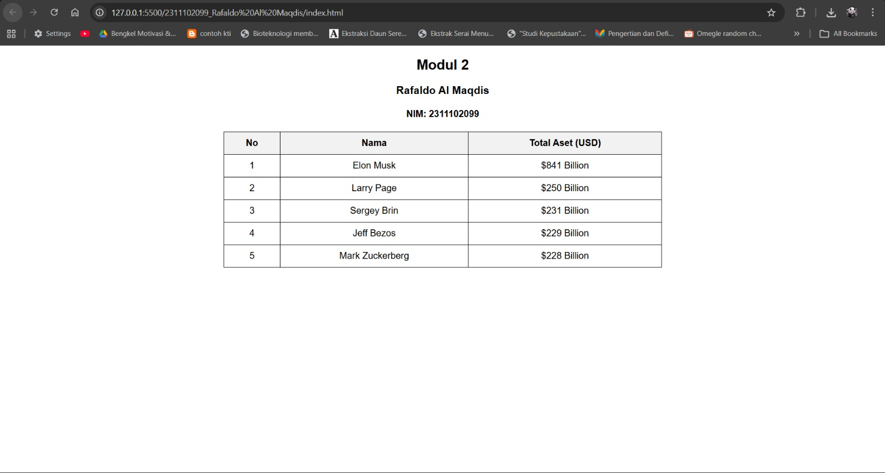

<div align="center">
  <br />
  <h1>LAPORAN PRAKTIKUM <br>APLIKASI BERBASIS PLATFORM</h1>
  <br />
  <h2>MODUL 2 <br>HTML</h2>
  <br /><br />

  

  <br /><br /><br />

  <h3>Disusun Oleh :</h3>

  <p>
    <strong>Rafaldo Al Maqdis</strong><br>
    <strong>2311102099</strong><br>
    <strong>S1 IF-11-REG 01</strong>
  </p>

  <br />

  <h3>Dosen Pengampu :</h3>

  <p>
    <strong>Dimas Fanny Hebrasianto Permadi, S.ST., M.Kom</strong>
  </p>

  <br /><br />

  <h4>Asisten Praktikum :</h4>

  <p>
    <strong>Apri Pandu Wicaksono</strong><br>
    <strong>Rangga Pradarrell Fathi</strong>
  </p>

  <br />

  <h2>
  LABORATORIUM HIGH PERFORMANCE <br>
  FAKULTAS INFORMATIKA <br>
  UNIVERSITAS TELKOM PURWOKERTO <br>
  2026
  </h2>
</div>

---

# 1. Dasar Teori

## Pengenalan HTML dan Struktur Tabel Dasar

HTML (*HyperText Markup Language*) merupakan bahasa markup yang digunakan untuk menyusun struktur dasar sebuah halaman web. HTML bekerja dengan menggunakan berbagai tag atau elemen yang saling tersusun secara hierarkis. Setiap tag memiliki fungsi tertentu yang memberi instruksi kepada browser mengenai bagaimana suatu konten, seperti teks, gambar, maupun elemen lainnya, ditampilkan pada layar pengguna.

Salah satu fitur dasar yang tersedia dalam HTML adalah pembuatan tabel. Dengan menggunakan elemen-elemen HTML tertentu, tabel dapat dibuat tanpa harus menggunakan CSS (*Cascading Style Sheets*).

Beberapa elemen utama yang digunakan untuk membentuk tabel pada HTML antara lain:

- `<table>` → berfungsi sebagai elemen utama yang menjadi wadah seluruh struktur tabel.
- `<tr>` → digunakan untuk membentuk baris pada tabel.
- `<th>` → berfungsi sebagai header atau judul kolom pada tabel.
- `<td>` → digunakan untuk menampilkan data atau isi pada setiap sel tabel.

---

## Penggabungan Sel pada Tabel

HTML juga menyediakan atribut khusus yang memungkinkan beberapa sel dalam tabel digabungkan menjadi satu.

Atribut tersebut meliputi:

- `rowspan` → digunakan untuk menggabungkan beberapa sel secara vertikal sehingga mencakup lebih dari satu baris.

- `colspan` → digunakan untuk menggabungkan beberapa sel secara horizontal sehingga mencakup lebih dari satu kolom.

---

## Perkembangan Desain Tabel HTML

Pada versi HTML yang lebih lama, tampilan tabel sering diatur menggunakan atribut seperti `border`, `cellpadding`, dan `cellspacing`. Selain itu, elemen `<center>` juga sering digunakan untuk memposisikan konten agar berada di tengah halaman.

Namun dalam praktik pengembangan web modern, pendekatan tersebut sudah jarang digunakan. Saat ini, pengaturan tampilan dan tata letak halaman lebih disarankan menggunakan CSS agar struktur HTML tetap sederhana, rapi, serta lebih mudah untuk dipelihara dan dikembangkan.

---

# 2. Penjelasan Kode HTML

Berikut merupakan contoh penerapan pembuatan tabel menggunakan HTML dasar beserta hasil tampilannya.

## Kode HTML (`tugas-2.html`)

```html
<!DOCTYPE html>
<html>
<head>
    <title>Modul 2</title>
    <style>
        body{
            text-align: center;
            font-family: Arial, sans-serif;
        }

        table{
            margin: auto;
            border-collapse: collapse;
            width: 50%;
        }

        th, td{
            border: 1px solid black;
            padding: 10px;
        }

        th{
            background-color: #f2f2f2;
        }
    </style>
</head>
<body>

    <h2>Modul 2</h2>
    <h3>Rafaldo Al Maqdis</h3>
    <h4>NIM: 2311102099</h4>

    <table>
        <tr>
            <th>No</th>
            <th>Nama</th>
            <th>Total Aset (USD)</th>
        </tr>

        <tr>
            <td>1</td>
            <td>Elon Musk</td>
            <td>$841 Billion</td>
        </tr>

        <tr>
            <td>2</td>
            <td>Larry Page</td>
            <td>$250 Billion</td>
        </tr>

        <tr>
            <td>3</td>
            <td>Sergey Brin</td>
            <td>$231 Billion</td>
        </tr>

        <tr>
            <td>4</td>
            <td>Jeff Bezos</td>
            <td>$229 Billion</td>
        </tr>

        <tr>
            <td>5</td>
            <td>Mark Zuckerberg</td>
            <td>$228 Billion</td>
        </tr>

    </table>

</body>
</html>
```

# 3. Hasil Tampilan (Screenshot)



### Penjelasan Code

### Penjelasan Code

- **Baris 1** menggunakan deklarasi `<!DOCTYPE html>` yang berfungsi untuk memberi tahu browser bahwa dokumen menggunakan standar **HTML5**.

- **Baris 2** menggunakan tag `<html>` sebagai elemen utama yang menjadi pembungkus seluruh isi dokumen HTML.

- **Baris 3–22** merupakan bagian `<head>` yang berisi informasi halaman seperti judul dan pengaturan tampilan menggunakan CSS.

- **Baris 4** menggunakan tag `<title>` yang berfungsi untuk menampilkan judul halaman pada tab browser, yaitu **“Modul 2”**.

- **Baris 5–22** menggunakan tag `<style>` untuk menuliskan **CSS internal** yang berfungsi mengatur tampilan halaman web.

- **Baris 7–10** mengatur tampilan pada elemen `<body>`, yaitu membuat seluruh teks berada di tengah dengan `text-align: center` serta menentukan jenis font menggunakan `font-family: Arial, sans-serif`.

- **Baris 12–16** mengatur tampilan tabel menggunakan selector `table`, dimana `margin: auto` berfungsi untuk memposisikan tabel di tengah halaman, `border-collapse: collapse` untuk menggabungkan garis tabel agar terlihat rapi, dan `width: 50%` untuk menentukan lebar tabel.

- **Baris 18–21** mengatur tampilan elemen `<th>` dan `<td>` dengan memberikan garis tabel menggunakan `border: 1px solid black` serta menambahkan ruang di dalam sel menggunakan `padding: 10px`.

- **Baris 23–25** mengatur tampilan khusus untuk header tabel `<th>` dengan memberikan warna latar belakang abu-abu menggunakan `background-color: #f2f2f2`.

- **Baris 27** menutup bagian `<head>` yang berisi metadata dan pengaturan tampilan halaman.

- **Baris 29** merupakan awal dari bagian `<body>` yang berisi seluruh konten yang akan ditampilkan pada halaman web.

- **Baris 31–33** menggunakan tag heading `<h2>`, `<h3>`, dan `<h4>` untuk menampilkan judul halaman yaitu **Modul 2**, diikuti dengan nama **Rafaldo Al Maqdis**, serta **NIM: 2311102099**.

- **Baris 35** menggunakan tag `<table>` untuk membuat tabel yang akan menampilkan data orang terkaya di dunia.

- **Baris 36–40** membuat baris pertama tabel menggunakan `<tr>` yang berisi header kolom menggunakan `<th>`, yaitu **No**, **Nama**, dan **Total Aset (USD)**.

- **Baris 42–46** merupakan baris pertama data tabel yang menampilkan nomor **1**, nama **Elon Musk**, serta total aset **$841 Billion**.

- **Baris 48–52** merupakan baris kedua tabel yang menampilkan nomor **2**, nama **Larry Page**, dan total aset **$250 Billion**.

- **Baris 54–58** merupakan baris ketiga tabel yang menampilkan nomor **3**, nama **Sergey Brin**, dan total aset **$231 Billion**.

- **Baris 60–64** merupakan baris keempat tabel yang menampilkan nomor **4**, nama **Jeff Bezos**, dan total aset **$229 Billion**.

- **Baris 66–70** merupakan baris kelima tabel yang menampilkan nomor **5**, nama **Mark Zuckerberg**, dan total aset **$228 Billion**.

- **Baris 72** menutup elemen tabel menggunakan tag `</table>`.

- **Baris 73** menutup seluruh dokumen HTML menggunakan tag `</body>` dan `</html>` yang menandakan bahwa struktur halaman web telah selesai dibuat.

### Refrensi

- [Materi Modul 2](https://drive.google.com/file/d/1Gcsi-U4rzqU0GC6dYTlzO7KUthrGoL8q/view?usp=sharing)