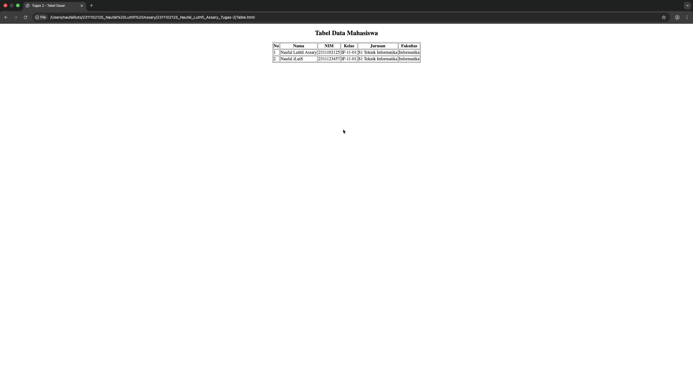

<div align="center">
  <br />
  <h1>LAPORAN PRAKTIKUM <br>APLIKASI BERBASIS PLATFORM</h1>
  <br />
  <h3>MODUL 2 <br> HTML</h3>
  <br />
  <br />
   
  <br />
  <br />
  <br />
  <br />
  <h3>Disusun Oleh :</h3>
  <p>
    <strong>NAUFAL LUTHFI ASSARY</strong><br>
    <strong>2311102125</strong><br>
    <strong>S1 IF-11-REG01</strong>
  </p>
  <br />
  <h3>Dosen Pengampu :</h3>
  <p>
    <strong>Dimas Fanny Hebrasianto Permadi, S.ST., M.Kom</strong>
  </p>
  <br />
  <br />
    <h4>Asisten Praktikum :</h4>
    <strong> Apri Pandu Wicaksono </strong> <br>
    <strong>Rangga Pradarrell Fathi</strong>
  <br />
  <h3>LABORATORIUM HIGH PERFORMANCE
 <br>FAKULTAS INFORMATIKA <br>UNIVERSITAS TELKOM PURWOKERTO <br>2026</h3>
</div>

---

## 1. Dasar Teori

**HTML atau HyperText Markup Language** merupakan bahasa dasar yang digunakan untuk membangun halaman web. HTML berfungsi untuk menyusun elemen-elemen dasar pada sebuah website, seperti judul, paragraf, tabel, gambar, hyperlink, dan form. Dalam struktur dasarnya, dokumen HTML terdiri dari deklarasi `<!DOCTYPE html>`, elemen `<html>`, `<head>`, dan `<body>`. Bagian `<body>` merupakan tempat semua konten yang ditampilkan pada browser.  

Dalam HTML, sebuah elemen dibentuk oleh tag. Tag umumnya terdiri dari tag pembuka dan tag penutup, misalnya `<p>...</p>` atau `<table>...</table>`. Selain itu, HTML juga memiliki atribut, yaitu informasi tambahan yang diletakkan pada tag pembuka untuk memberikan fungsi tertentu pada elemen. Atribut dapat digunakan untuk mengatur identitas elemen, ukuran, tujuan link, maupun karakteristik tampilan dasar.  

Salah satu elemen penting dalam HTML adalah tabel. Tabel digunakan untuk menampilkan data dalam bentuk baris dan kolom sehingga informasi menjadi lebih terstruktur dan mudah dibaca. Pada HTML, tabel didefinisikan dengan tag `<table>`, sedangkan baris tabel ditulis dengan tag `<tr>`, judul kolom menggunakan tag `<th>`, dan isi data menggunakan tag `<td>`. Dengan susunan tersebut, data dapat ditampilkan secara sistematis sesuai kebutuhan pengguna.  

Selain membuat tabel dasar, HTML juga mendukung penggabungan sel menggunakan atribut colspan dan rowspan. Atribut colspan digunakan untuk menggabungkan beberapa kolom, sedangkan rowspan digunakan untuk menggabungkan beberapa baris. Fitur ini berguna ketika tabel memerlukan susunan data yang lebih kompleks. Namun, pada tugas tabel dasar, elemen yang paling utama digunakan adalah `<table>`, `<tr>`, `<th>`, dan `<td>`.  

Untuk menempatkan tampilan di bagian tengah halaman tanpa menggunakan CSS, HTML dapat menggunakan tag `<center>`. Pada modul praktikum, tag ini dicontohkan untuk meletakkan form di bagian tengah halaman. Dengan demikian, pada pembuatan tabel dasar tanpa bantuan CSS maupun styling lainnya, tabel dapat dibungkus menggunakan tag `<center>` agar tampil di tengah secara horizontal pada halaman web.

---

## 2. Penjelasan Kode HTML

Berikut merupakan implementasi Tabel dengan menggunakan HTML.

### Kode HTML (`Table.html`)

```html
<!DOCTYPE html>
<html>
<head>
    <title>Tugas 2 - Tabel Dasar</title>
</head>
<body>
    <center>
        <h2>Tabel Data Mahasiswa</h2>
        <table border="1">
            <tr>
                <th>No</th>
                <th>Nama</th>
                <th>NIM</th>
                <th>Kelas</th>
                <th>Jurusan</th>
                <th>Fakultas</th>
            </tr>
            <tr>
                <td>1</td>
                <td>Naufal Luthfi Assary</td>
                <td>2311102125</td>
                <td>IF-11-01</td>
                <td>S1 Teknik Informatika</td>
                <td>Informatika</td>
            </tr>
            <tr>
                <td>2</td>
                <td>Naufal iLutS</td>
                <td>2311123457</td>
                <td>IF-11-01</td>
                <td>S1 Teknik Informatika</td>
                <td>Informatika</td>
            </tr>
        </table>
    </center>
</body>
</html>
```

### Hasil Tampilan (Screenshot)



### Penjelasan Code:

- `<!DOCTYPE html>`
  - Digunakan untuk menyatakan bahwa dokumen yang dibuat adalah HTML5.

- `<html>`
  - Merupakan tag utama yang menandai awal dan akhir seluruh dokumen HTML.

- `<head>`
  - Berisi informasi tentang halaman web, seperti judul halaman.

- `<title>Tugas 2 - Tabel Dasar</title>`
  - Digunakan untuk menampilkan judul halaman pada tab browser.

- `<body>`
  - Berisi semua isi halaman web yang akan ditampilkan di browser.

- `<center>`
  - Digunakan untuk meletakkan isi halaman, yaitu judul dan tabel, agar berada di tengah halaman secara horizontal.
  - Tag ini dipakai karena pada tugas tidak boleh menggunakan CSS atau styling.

- `<h2>Tabel Data Mahasiswa</h2>`
  - Digunakan untuk menampilkan judul utama pada halaman.
  - Tag `<h2>` termasuk heading yang berfungsi sebagai penanda judul konten.

- `<table border="1">`
  - Digunakan untuk membuat tabel.
  - Atribut `border="1"` berfungsi untuk memberikan garis pada tabel agar baris dan kolom terlihat jelas.

- `<tr>`
  - Digunakan untuk membuat baris pada tabel.

- `<th>`
  - Digunakan untuk membuat judul kolom pada tabel.
  - Pada contoh, judul kolomnya adalah **No**, **Nama**, **NIM**, **Kelas**, **Jurusan**, dan **Fakultas**.

- `<td>`
  - Digunakan untuk mengisi data pada setiap sel tabel.
  - Data yang ditampilkan misalnya nomor, nama mahasiswa, NIM, kelas, Jurusan, dan Fakultas.

- Baris pertama tabel
  - Berisi heading atau judul kolom dengan tag `<th>`.

- Baris kedua dan seterusnya
  - Berisi data mahasiswa dengan tag `<td>`.

- `</table>`
  - Menandai akhir dari tabel.

- `</center>`
  - Menandai akhir dari bagian yang diposisikan di tengah halaman.

- `</body>` dan `</html>`
  - Menandai akhir isi halaman dan akhir dokumen HTML.

## Refrensi
- [Materi Modul 2](https://drive.google.com/file/d/1Gcsi-U4rzqU0GC6dYTlzO7KUthrGoL8q/view?usp=sharing)