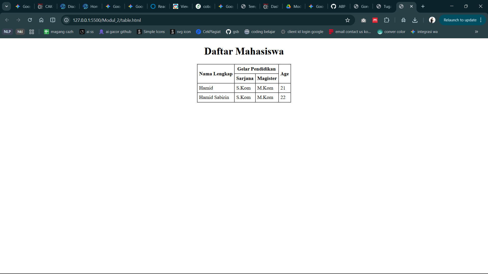

<div align="center">
  <br />
  <h1>LAPORAN PRAKTIKUM <br>APLIKASI BERBASIS PLATFORM</h1>
  <br />
  <h3>MODUL 2 <br> HTML</h3>
  <br />
  <br />
   
  <br />
  <br />
  <br />
  <h3>Disusun Oleh :</h3>
  <p>
    <strong>HAMID SABIRIN</strong><br>
    <strong>2311102129</strong><br>
    <strong>S1 IF-11-REG01</strong>
  </p>
  <br />
  <h3>Dosen Pengampu :</h3>
  <p>
    <strong>Dimas Fanny Hebrasianto Permadi, S.ST., M.Kom</strong>
  </p>
  <br />
  <br />
    <h4>Asisten Praktikum :</h4>
    <strong> Apri Pandu Wicaksono </strong> <br>
    <strong>Rangga Pradarrell Fathi</strong>
  <br />
  <h3>LABORATORIUM HIGH PERFORMANCE
 <br>FAKULTAS INFORMATIKA <br>UNIVERSITAS TELKOM PURWOKERTO <br>2026</h3>
</div>

---

## 1. Dasar Teori

**HTML (HyperText Markup Language)** merupakan bahasa markah standar web yang digunakan untuk membuat dan menyusun struktur sebuah halaman website. HTML bekerja menggunakan sederet tag bersarang (nested element) untuk memberi tahu *web browser* bagaimana cara menampilkan elemen teks, gambar, maupun layout secara keseluruhan di layar.

Dalam pembuatan struktur tabel murni memanfaatkan HTML (tanpa bantuan dari *Cascading Style Sheets* atau CSS), kita dapat menggunakan format elemen `<table>` dan didukung oleh tag `<tr>` untuk baris, `<th>` untuk header tabel, serta `<td>` untuk sel data tabel.

HTML juga menyediakan atribut seperti `rowspan` untuk menggabungkan baris dan `colspan` untuk menggabungkan kolom. Atribut lain yang sering digunakan pada sisi presentasi (*meskipun format ini lebih tua*) meliputi `<center>` untuk meratakan konten di tengah dan `border`, `cellpadding`, `cellspacing` pada tag `<table>` untuk mengatur spasi sel dan border batas garis.

---

## 2. Penjelasan Kode HTML

Berikut ini adalah implementasi tabel berdasarkan struktur dasar HTML murni beserta hasil tampilannya.

### Kode HTML (`table.html`)

```html
<!DOCTYPE html>
<html>
<head>
    <title>Tabel Dasar</title>
</head>
<body>
    <center>
        <table border="1" cellpadding="5" cellspacing="0">
            <tr>
                <th rowspan="2">Nama Lengkap</th>
                <th colspan="2">Gelar Pendidikan</th>
                <th rowspan="2">Age</th>
            </tr>
            <tr>
                <th>Sarjana</th>
                <th>Magister</th>
            </tr>
            <tr>
                <td>Hamid</td>
                <td>S.Kom</td>
                <td>M.Kom</td>
                <td>21</td>
            </tr>
            <tr>
                <td>Hamid Sabirin</td>
                <td>S.Kom</td>
                <td>M.Kom</td>
                <td>22</td>
            </tr>
        </table>
    </center>
</body>
</html>
```

### Hasil Tampilan (Screenshot)



### Penjelasan code:

- Pada baris **7-32**, penggunaan tag pembungkus `<center>` murni bawan HTML bertujuan agar seluruh elemen tabel yang ada di dalamnya secara otomatis diletakkan persis pada posisi rata tengah area layar browser tanpa perlu adanya selipan sintaks kode CSS tambahan.
- Pada baris **9**, atribut bawaan `border="1"`, `cellpadding="5"`, dan `cellspacing="0"` dieksekusi bersama pada tag target induk `<table>`. Fungsinya secara berurutan adalah demi mematok satu batas garis setebal 1 piksel di antara sel, memberikan pelonggaran sejauh 5 piksel antara karakter di dalam dan garis tepinya, serta menghapus celah sisa jarak dinding ganda yang secara bawaan melekat di setiap kolom HTML.
- Pada baris **11-12**, tag header lajur header `<th>` memanggil argumen properti tambahan berupa `rowspan` dan `colspan`. Elemen `rowspan="2"` pada baris perintah `Nama Lengkap` berfungsi meleburkan area sel sebanyak dua kotak menyilang ke arah bawah baris, sekaligus sebaliknya atribut `colspan="2"` pada penanda area `Gelar Pendidikan` memperluas penggabungan kapasitas lajur kolom mengarah menyamping horizontal yang nantinya disediakan mengitari dua kolom anaknya (kolom "Sarjana" & "Magister").
- Pada baris **19-30**, sisa baris isian tabel dibagi dengan elemen `<td>` yang dikelompokkan baris ke baris menggunakan tag awal `<tr>`. Setiap tag baris `<tr>` akan dieksekusi bergiliran sebagai bungkus satu profil entri mahasiswa, disusul per elemen anaknya berisikan data sejajar rata kolom.
