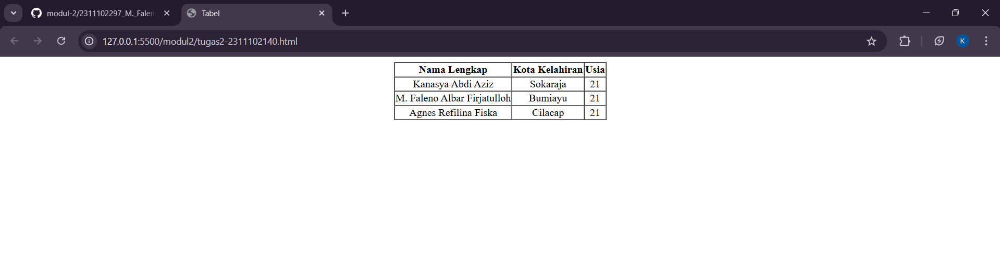

---
<center>
# LAPORAN PRAKTIKUM

## ALGORITMA PEMROGRAMAN

### MODUL 2

### HTML

<br>

<div align="center">


<br><br>

### Disusun Oleh

**Kanasya Abdi Aziz**
**2311102140**
**S1 IF-11-01**

<br>

### Dosen Pengampu

**Dimas Fanny Hebrasianto Permadi, S.ST., M.Kom**

<br>

### Asisten Praktikum

**Apri Pandu Wicaksono**
**Rangga Pradarrell Fathi**

<br><br>

### LABORATORIUM HIGH PERFORMANCE

### FAKULTAS INFORMATIKA

### UNIVERSITAS TELKOM PURWOKERTO

### 2026

</div>
</center>
---

# 1. Dasar Teori

HTML (HyperText Markup Language) merupakan bahasa markup standar yang digunakan untuk membuat struktur dasar sebuah halaman web. HTML bekerja menggunakan sistem elemen atau tag yang saling bersarang (*nested*) sehingga browser dapat memahami bagaimana sebuah konten harus ditampilkan pada halaman web.

Salah satu fitur dasar HTML adalah kemampuan untuk membuat tabel. Pembuatan tabel dilakukan dengan beberapa elemen utama. Elemen `<table>` berfungsi sebagai wadah utama yang membungkus seluruh struktur tabel. Di dalamnya terdapat elemen `<tr>` yang digunakan untuk mendefinisikan baris pada tabel. Setiap baris dapat berisi elemen `<th>` atau `<td>`. Elemen `<th>` digunakan untuk membuat judul kolom atau baris yang biasanya ditampilkan dalam bentuk teks tebal, sedangkan elemen `<td>` digunakan untuk menampilkan data atau isi dari tabel.

Selain itu, HTML juga menyediakan atribut yang memungkinkan penggabungan beberapa sel dalam tabel. Atribut `colspan` digunakan untuk menggabungkan beberapa kolom secara horizontal, sedangkan atribut `rowspan` digunakan untuk menggabungkan beberapa baris secara vertikal. Fitur ini sangat berguna ketika membuat tata letak tabel yang lebih kompleks.

---

# 2. Penjelasan Kode HTML (Unguided)

Berikut merupakan implementasi tabel data mahasiswa menggunakan HTML sesuai dengan tugas praktikum.

---

## Kode HTML (unguided.html)

```html
<!DOCTYPE html>
<html lang="id">
<head>
    <title>Tabel</title>
</head>

<body>
    <center>

        <table width="80%" border="1" cellpadding="1" cellspacing="0">

            <tr>
                <th>Nama Lengkap</th>
                <th>Kota Kelahiran</th>
                <th>Usia</th>
            </tr>

            <tr align="center">
                <td>Kanasya Abdi Aziz</td>
                <td>Sokaraja</td>
                <td>21</td>
            </tr>

            <tr align="center">
                <td>M. Faleno Albar Firjatulloh</td>
                <td>Bumiayu</td>
                <td>21</td>
            </tr>

            <tr align="center">
                <td>Agnes Refilina Fiska</td>
                <td>Cilacap</td>
                <td>21</td>
            </tr>

        </table>

        <br><br><br>

    </center>
</body>
</html>
```

---

## Hasil Tampilan (Screenshot)



---

# Penjelasan Kode

### 1. Struktur Dasar HTML

Tag `<body>` merupakan bagian dari dokumen HTML yang berisi seluruh konten visual yang akan ditampilkan pada halaman web, seperti teks, gambar, tabel, dan elemen lainnya.

Pada kode ini juga digunakan tag `<center>` untuk menempatkan tabel di bagian tengah halaman secara horizontal. Namun perlu diketahui bahwa tag `<center>` saat ini sudah dianggap **deprecated** dalam standar HTML modern. Dalam praktik pengembangan web saat ini, pengaturan posisi seperti ini biasanya dilakukan menggunakan CSS, misalnya dengan menggunakan `margin: auto`.

---

### 2. Komponen Tabel

Tabel dibuat menggunakan tag `<table>` yang memiliki beberapa atribut pendukung untuk mengatur tampilannya.

* `border="1"` digunakan untuk menampilkan garis tepi pada tabel sehingga setiap sel terlihat jelas.
* `cellpadding="1"` berfungsi memberikan jarak antara isi teks dengan garis tepi sel.
* `cellspacing="0"` digunakan untuk menghilangkan jarak antar sel sehingga garis tabel terlihat menyatu.
* `width="80%"` digunakan untuk menentukan lebar tabel sebesar 80% dari lebar halaman.

---

### 3. Isi Data Tabel

Tabel terdiri dari dua bagian utama yaitu header tabel dan data tabel.

**Header Tabel** berada pada baris pertama yang menggunakan elemen `<th>`. Elemen ini secara otomatis menampilkan teks dengan format tebal (*bold*). Header pada tabel ini terdiri dari tiga kolom yaitu:

* Nama Lengkap
* Kota Kelahiran
* Usia

**Data Tabel** berada pada baris berikutnya yang menggunakan elemen `<td>`. Pada setiap baris digunakan atribut `align="center"` agar seluruh teks pada baris tersebut ditampilkan rata tengah.

Data yang ditampilkan pada tabel tersebut adalah:

1. Kanasya Abdi Aziz – Sokaraja – 21 tahun
2. M. Faleno Albar Firjatulloh – Bumiayu – 21 tahun
3. Agnes Refilina Fiska – Cilacap – 21 tahun

---

# Referensi

* [Materi Modul 2](https://drive.google.com/file/d/1Gcsi-U4rzqU0GC6dYTlzO7KUthrGoL8q/view?usp=sharing)

---