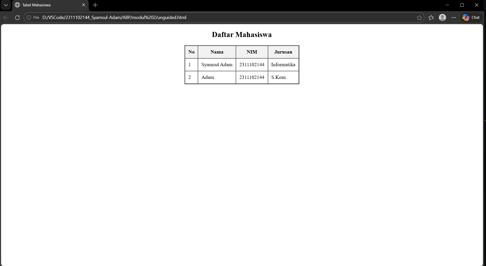

<div align="center">
  <br />
  <h1>LAPORAN PRAKTIKUM <br>APLIKASI BERBASIS PLATFORM</h1>
  <br />
  <h3>MODUL 2 <br> HTML</h3>
  <br />
  <br />
   
  <br />
  <br />
  <br />
  <h3>Disusun Oleh :</h3>
  <p>
    <strong>Syamsul Adam</strong><br>
    <strong>2311102144</strong><br>
    <strong>S1 IF-11-01</strong>
  </p>
  <br />
  <h3>Dosen Pengampu :</h3>
  <p>
    <strong>Dimas Fanny Hebrasianto Permadi, S.ST., M.Kom</strong>
  </p>
  <br />
  <br />
    <h4>Asisten Praktikum :</h4>
    <strong> Apri Pandu Wicaksono </strong> <br>
    <strong>Rangga Pradarrell Fathi</strong>
  <br />
  <h3>LABORATORIUM HIGH PERFORMANCE
 <br>FAKULTAS INFORMATIKA <br>UNIVERSITAS TELKOM PURWOKERTO <br>2026</h3>
</div>

---

## 1. Dasar Teori

HTML (HyperText Markup Language) merupakan fondasi utama dalam merancang kerangka sebuah situs web. Cara kerjanya mengandalkan sistem tag atau elemen yang saling bersarang (nested) untuk menginstruksikan peramban (browser) bagaimana cara menyajikan konten, baik itu teks, gambar, maupun media lainnya.

Salah satu fitur yang tersedia pada HTML adalah pembuatan tabel. Tabel dapat dibuat langsung menggunakan elemen HTML tanpa harus menggunakan bantuan CSS (Cascading Style Sheets). Dalam struktur tabel HTML terdapat beberapa elemen utama, antara lain:

- `<table>` Kontainer utama yang membungkus seluruh struktur tabel.
- `<tr>` Digunakan untuk mendefinisikan baris baru dalam tabel.
- `<th>` Menandakan sel sebagai header atau judul kolom (biasanya teks otomatis tebal).
- `<td>` Digunakan untuk mengisi sel dengan data atau konten.


Pada HTML versi lama juga terdapat beberapa atribut presentasi seperti `border` yang berfungsi untuk ketebalan border, dan tag `<center>` dapat digunakan untuk menempatkan elemen pada posisi tengah halaman. 

---

## 2. Penjelasan Kode HTML

Berikut ini adalah implementasi tabel berdasarkan struktur dasar HTML murni beserta hasil tampilannya.

### Kode HTML (`table.html`)

```html
<!DOCTYPE html>
<html>

<head>
    <title>Tabel Mahasiswa</title>
</head>

<body>

    <h2 align="center">Daftar Mahasiswa</h2>

    <table border="2" align="center" cellpadding="10" cellspacing="0">
        <tr bgcolor="#f2f2f2">
            <th>No</th>
            <th>Nama</th>
            <th>NIM</th>
            <th>Jurusan</th>
        </tr>

        <tr>
            <td>1</td>
            <td>Syamsul Adam</td>
            <td>2311102144</td>
            <td>Informatika</td>
        </tr>

        <tr>
            <td>2</td>
            <td>Adam</td>
            <td>2311102144</td>
            <td>S.Kom</td>
        </tr>

    </table>

</body>

</html>
```

### Hasil Tampilan (Screenshot)

 

### Penjelasan Code

Program ini merupakan implementasi halaman web statis berbasis HTML yang dirancang untuk menampilkan data informasi mahasiswa secara terstruktur menggunakan elemen tabel. Dengan memanfaatkan atribut standar seperti border untuk penegasan garis, align untuk pengaturan posisi tengah, serta cellpadding untuk estetika tata letak, program ini berhasil menyajikan data yang terdiri dari kolom nomor, nama, NIM, dan jurusan secara rapi dan mudah dibaca. Struktur kode ini mengandalkan hierarki tag table, tr, th, dan td, yang berfungsi untuk memisahkan antara bagian sel kepala tabel dengan baris data isi, sehingga memberikan representasi informasi yang logis dan fungsional di dalam browser.

## Refrensi

- [Materi Modul 2](https://drive.google.com/file/d/1Gcsi-U4rzqU0GC6dYTlzO7KUthrGoL8q/view?usp=sharing)
