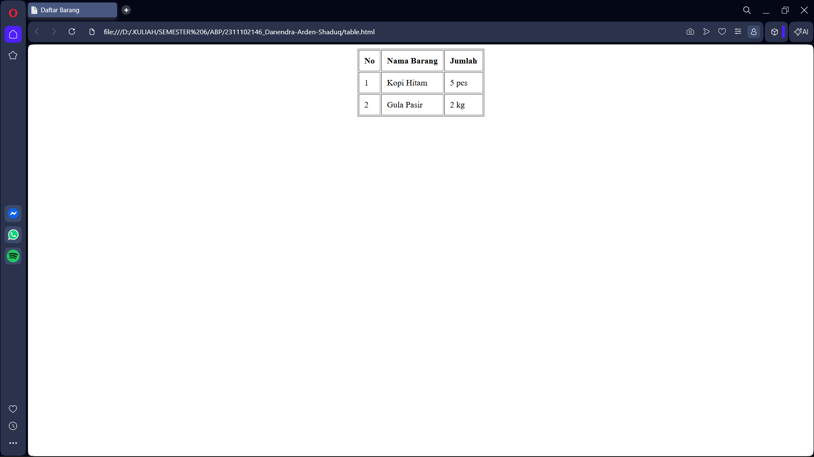

<div align="center">
  <br />
  <h1>LAPORAN PRAKTIKUM <br>APLIKASI BERBASIS PLATFORM</h1>
  <br />
  <h3>MODUL 2 <br> HTML</h3>
  <br />
  <br />
   
  <br />
  <br />
  <br />
  <h3>Disusun Oleh :</h3>
  <p>
    <strong>DANENDRA ARDEN SHADUQ</strong><br>
    <strong>2311102146</strong><br>
    <strong>S1 IF-11-REG01</strong>
  </p>
  <br />
  <h3>Dosen Pengampu :</h3>
  <p>
    <strong>Dimas Fanny Hebrasianto Permadi, S.ST., M.Kom</strong>
  </p>
  <br />
  <br />
    <h4>Asisten Praktikum :</h4>
    <strong> Apri Pandu Wicaksono </strong> <br>
    <strong>Rangga Pradarrell Fathi</strong>
  <br />
  <h3>LABORATORIUM HIGH PERFORMANCE
 <br>FAKULTAS INFORMATIKA <br>UNIVERSITAS TELKOM PURWOKERTO <br>2026</h3>
</div>

---

## 1. Dasar Teori

**HTML (HyperText Markup Language)** merupakan bahasa markup standar yang digunakan untuk membangun dan menyusun struktur dasar sebuah halaman web. HTML berfungsi untuk menentukan bagaimana konten seperti teks, gambar, tabel, maupun multimedia ditampilkan pada browser. Dengan menggunakan HTML, pengembang dapat membuat struktur halaman web yang terdiri dari berbagai elemen yang saling terhubung sehingga membentuk tampilan informasi yang terorganisir dan mudah diakses oleh pengguna. HTML menjadi dasar utama dalam pengembangan web sebelum dipadukan dengan teknologi lain seperti CSS untuk desain tampilan dan JavaScript untuk interaktivitas.

Dalam HTML terdapat beberapa komponen penting seperti tag, elemen, dan atribut. Tag merupakan penanda yang digunakan untuk mendefinisikan bagian tertentu dalam dokumen HTML, biasanya terdiri dari tag pembuka dan tag penutup yang mengapit sebuah konten. Elemen HTML adalah kombinasi dari tag pembuka, isi konten, dan tag penutup yang membentuk suatu bagian dalam halaman web. Selain itu, atribut HTML digunakan untuk memberikan informasi tambahan pada tag, misalnya untuk menentukan warna, ukuran, atau identitas suatu elemen. Atribut biasanya dituliskan pada tag pembuka dengan format nama_atribut=`nilai`.

---

## 2. Penjelasan Kode HTML

Di bawah ini merupakan penerapan tabel yang disusun menggunakan struktur dasar HTML murni, lengkap dengan visualisasi hasil tampilannya.

### Kode HTML (`table.html`)

```<!DOCTYPE html>
<html>
<head>
    <title>Daftar Barang</title>
</head>
<body>

    <table border="1" align="center" cellpadding="10">
        <thead>
            <tr>
                <th>No</th>
                <th>Nama Barang</th>
                <th>Jumlah</th>
            </tr>
        </thead>
        <tbody>
            <tr>
                <td>1</td>
                <td>Kopi Hitam</td>
                <td>5 pcs</td>
            </tr>
            <tr>
                <td>2</td>
                <td>Gula Pasir</td>
                <td>2 kg</td>
            </tr>
        </tbody>
    </table>

</body>
</html>
```

### Hasil Tampilan (Screenshot)



### Penjelasan code:

Di dalam bagian `<body>`, terdapat penggunaan tag `<table>` dengan atribut border untuk memberikan garis tepi, `align="center"` agar tabel berada di posisi tengah halaman, serta `cellpadding` untuk memberikan ruang di dalam sel agar teks tidak terlihat rapat. Struktur tabel tersebut dibagi secara rapi menggunakan tag `<thead>` untuk baris judul kolom (Nomor, Nama Barang, dan Jumlah) serta `<tbody>` untuk menampung isi datanya. Setiap baris data didefinisikan dengan tag `<tr>`, sementara informasi di dalamnya menggunakan tag `<td>` untuk sel data biasa dan `<th>` untuk bagian kepala tabel agar teks tercetak tebal secara otomatis.

## Refrensi
- [Materi Modul 2](https://drive.google.com/file/d/1Gcsi-U4rzqU0GC6dYTlzO7KUthrGoL8q/view?usp=sharing)