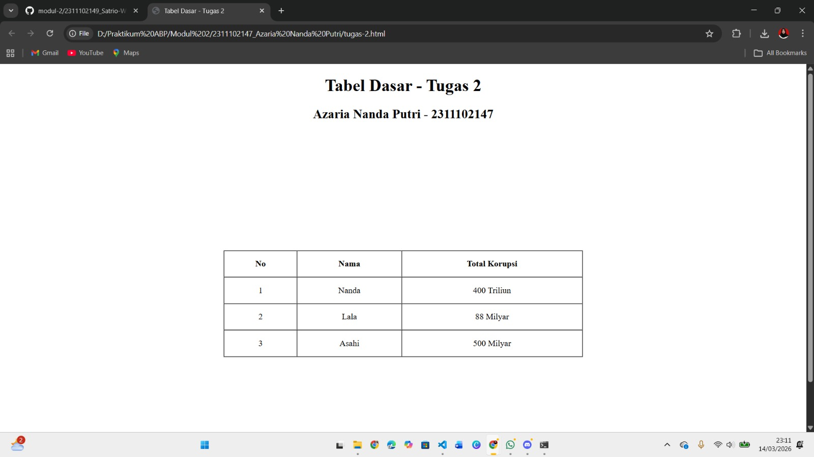

<div align="center">
  <br />
  <h1>LAPORAN PRAKTIKUM <br>APLIKASI BERBASIS PLATFORM</h1>
  <br />
  <h2>MODUL 2 <br>HTML</h2>
  <br />
  <br />
   
  <br />
  <br />
  <br />
  <h3>Disusun Oleh :</h3>
  <p>
    <strong>Azaria Nanda Putri</strong><br>
    <strong>2311102147</strong><br>
    <strong>S1 IF-11-REG 01</strong>
  </p>
  <br />
  <h3>Dosen Pengampu :</h3>
  <p>
    <strong>Dimas Fanny Hebrasianto Permadi, S.ST., M.Kom</strong>
  </p>
  <br />
  <br />
    <h4>Asisten Praktikum :</h4>
    <strong> Apri Pandu Wicaksono </strong> <br>
    <strong>Rangga Pradarrell Fathi</strong>
  <br />
  <h2>LABORATORIUM HIGH PERFORMANCE
 <br>FAKULTAS INFORMATIKA <br>UNIVERSITAS TELKOM PURWOKERTO <br>2026</h2>
</div>


---

# 1. Dasar Teori

###  Pengenalan HTML dan Struktur Tabel Dasar

HTML (*HyperText Markup Language*) merupakan bahasa markup yang digunakan untuk menyusun struktur dasar sebuah halaman web. HTML bekerja dengan menggunakan berbagai tag atau elemen yang saling tersusun secara hierarkis. Setiap tag memiliki fungsi tertentu yang memberi instruksi kepada browser mengenai bagaimana suatu konten, seperti teks, gambar, maupun elemen lainnya, ditampilkan pada layar pengguna.

Salah satu fitur dasar yang tersedia dalam HTML adalah pembuatan tabel. Dengan menggunakan elemen-elemen HTML tertentu, tabel dapat dibuat tanpa harus menggunakan CSS (*Cascading Style Sheets*).

Beberapa elemen utama yang digunakan untuk membentuk tabel pada HTML antara lain:

- `<table>` → berfungsi sebagai elemen utama atau wadah tabel.  
- `<tr>` → digunakan untuk membuat baris pada tabel.  
- `<th>` → digunakan sebagai header atau judul kolom tabel.  
- `<td>` → berfungsi untuk menampilkan isi data pada setiap sel tabel.  

## Penggabungan Sel pada Tabel

HTML juga menyediakan atribut khusus yang memungkinkan beberapa sel dalam tabel digabungkan. Atribut tersebut yaitu:

- `rowspan` → digunakan untuk menggabungkan sel secara vertikal atau beberapa baris.  
- `colspan` → digunakan untuk menggabungkan sel secara horizontal atau beberapa kolom.  

## Perkembangan Desain Tabel HTML

Pada versi HTML yang lebih lama, tampilan tabel sering diatur menggunakan atribut seperti `border`, `cellpadding`, dan `cellspacing`. Selain itu, tag `<center>` juga digunakan untuk menempatkan elemen di tengah halaman.

Namun dalam pengembangan web modern, pendekatan tersebut mulai ditinggalkan. Pengaturan tampilan maupun tata letak halaman kini lebih dianjurkan menggunakan CSS agar struktur HTML tetap sederhana dan lebih mudah dikelola.

---

# 2. Penjelasan Kode HTML

Berikut merupakan contoh implementasi pembuatan tabel menggunakan HTML dasar beserta tampilan hasilnya.

### Kode HTML (`tugas-2.html`)

```
html
<!DOCTYPE html>
<html lang="id">
<head>
    <meta charset="UTF-8">
    <meta name="viewport" content="width=device-width, initial-scale=1.0">
    <title>Tabel Dasar - Tugas 2</title>
</head>

<center>
    <h1>Tabel Dasar - Tugas 2</h1>
    <h2>Azaria Nanda Putri - 2311102147</h2>
</center>
<body>

    <table width="100%" height="650" cellpadding="0" cellspacing="0">
        <tr>
            <td align="center" valign="middle">
                
                <table border="1" cellpadding="15" cellspacing="0" width="45%">
                    <thead>
                        <tr>
                            <th>No</th>
                            <th>Nama</th>
                            <th>Total Korupsi</th>
                        </tr>
                    </thead>
                    <tbody align="center">
                        <tr>
                            <td>1</td>
                            <td>Nanda</td>
                            <td>400 Triliun</td>
                        </tr>
                        <tr>
                            <td>2</td>
                            <td>Lala</td>
                            <td>88 Milyar</td>
                        </tr>
                        <tr>
                            <td>3</td>
                            <td>Asahi</td>
                            <td>500 Milyar</td>
                        </tr>
                    </tbody>
                </table>

            </td>
        </tr>
    </table>

</body>
</html>
```

# 3. Hasil Tampilan (Screenshot)



### Penjelasan Code

- **Baris 1** menggunakan deklarasi `<!DOCTYPE html>` yang berfungsi untuk memberi tahu browser bahwa dokumen menggunakan standar **HTML5**.

- **Baris 2** menggunakan tag `<html lang="id">` sebagai elemen utama dokumen HTML. Atribut `lang="id"` menunjukkan bahwa bahasa yang digunakan pada halaman adalah **Bahasa Indonesia**.

- **Baris 3–7** merupakan bagian `<head>` yang berisi metadata halaman, seperti pengaturan karakter (`charset="UTF-8"`), pengaturan tampilan layar (`viewport`), serta judul halaman yang ditampilkan pada tab browser melalui tag `<title>` yaitu **“Tabel Dasar - Tugas 2”**.

- **Baris 9–12** menggunakan tag `<center>` untuk menampilkan judul halaman `<h1>` serta identitas pembuat `<h2>` di bagian tengah halaman.

- **Baris 13** merupakan awal dari bagian `<body>` yang berisi seluruh elemen dan konten yang akan ditampilkan pada halaman web.

- **Baris 15** membuat tabel utama dengan atribut `width="100%"` dan `height="650"` yang berfungsi sebagai wadah untuk membantu memposisikan tabel utama di tengah halaman.

- **Baris 16–18** menggunakan elemen `<tr>` dan `<td>` dengan atribut `align="center"` dan `valign="middle"` agar tabel yang berada di dalamnya tampil di tengah secara horizontal maupun vertikal.

- **Baris 20** membuat tabel kedua yang berfungsi untuk menampilkan data utama dengan atribut `border="1"`, `cellpadding="15"`, `cellspacing="0"`, dan `width="45%"`.

- **Baris 21–27** menggunakan `<thead>` dan `<th>` untuk membuat bagian header tabel yang berisi judul kolom yaitu **No**, **Nama**, dan **Total Korupsi**.

- **Baris 28–42** menggunakan `<tbody>` yang berisi data tabel. Setiap baris menggunakan `<tr>`, sedangkan setiap sel menggunakan `<td>` untuk menampilkan data seperti nomor, nama, dan jumlah nilai.

- **Baris akhir** menutup seluruh struktur HTML menggunakan tag `</table>`, `</body>`, dan `</html>` yang menandakan bahwa dokumen HTML telah selesai dibuat.

### Refrensi

- [Materi Modul 2](https://drive.google.com/file/d/1Gcsi-U4rzqU0GC6dYTlzO7KUthrGoL8q/view?usp=sharing)