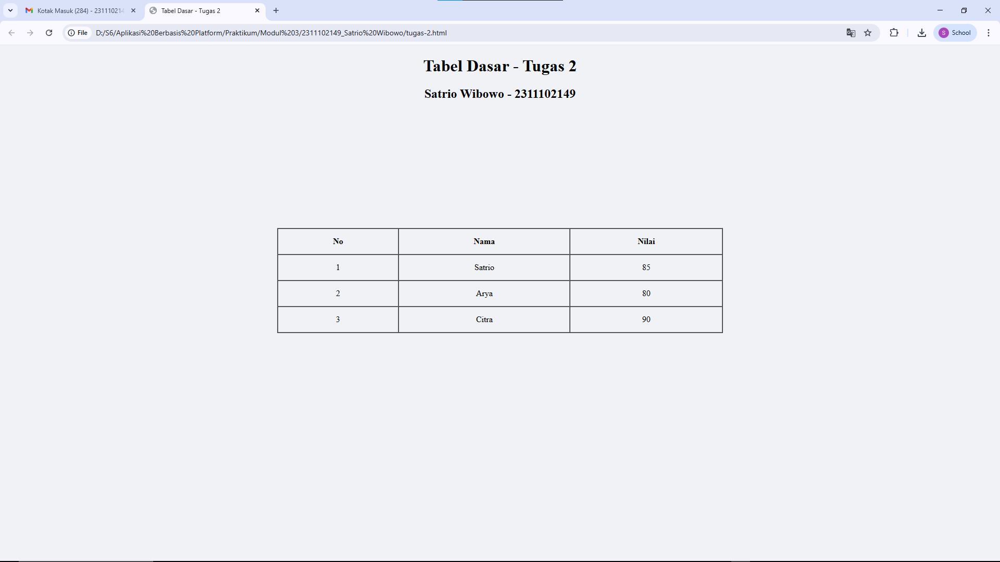

<div align="center">
  <br />
  <h1>LAPORAN PRAKTIKUM <br>APLIKASI BERBASIS PLATFORM</h1>
  <br />
  <h2>MODUL 2 <br> HTML</h2>
  <br />
  <br />
   
  <br />
  <br />
  <br />
  <h3>Disusun Oleh :</h3>
  <p>
    <strong>Satrio Wibowo</strong><br>
    <strong>2311102149</strong><br>
    <strong>S1 IF-11-REG 01</strong>
  </p>
  <br />
  <h3>Dosen Pengampu :</h3>
  <p>
    <strong>Dimas Fanny Hebrasianto Permadi, S.ST., M.Kom</strong>
  </p>
  <br />
  <br />
    <h4>Asisten Praktikum :</h4>
    <strong> Apri Pandu Wicaksono </strong> <br>
    <strong>Rangga Pradarrell Fathi</strong>
  <br />
  <h2>LABORATORIUM HIGH PERFORMANCE
 <br>FAKULTAS INFORMATIKA <br>UNIVERSITAS TELKOM PURWOKERTO <br>2026</h2>
</div>

---

# 1. Dasar Teori


### Mengenal HTML dan Struktur Dasar Tabel
HTML (HyperText Markup Language) adalah bahasa markah utama yang berfungsi untuk membangun kerangka dasar sebuah situs web. Bahasa ini bekerja menggunakan sistem tag atau elemen yang tersusun berlapis (nested). Fungsi tag ini adalah memberikan instruksi kepada browser mengenai cara menampilkan konten, seperti teks dan gambar, di layar pengguna.

Salah satu fitur dasar HTML adalah pembuatan tabel, yang bisa dilakukan secara langsung tanpa memerlukan CSS (Cascading Style Sheets).

Berikut adalah elemen-elemen inti pembentuk tabel pada HTML:
- `<table>`: Berfungsi sebagai wadah atau pembungkus utama tabel.
- `<tr>`: Digunakan untuk membuat baris baru di dalam tabel.
- `<th>`: Berfungsi sebagai sel header atau judul pada tabel.
- `<td>`: Digunakan untuk mengisi sel data di dalam tabel.

### Menggabungkan Sel Tabel
Selain itu, HTML juga menyediakan beberapa atribut yang memungkinkan penggabungan sel dalam tabel, yaitu:

- `rowspan`: Digunakan untuk menggabungkan beberapa baris.
- `colspan` Digunakan untuk menggabungkan beberapa kolom.

### Evolusi Desain Tabel HTML
Pada versi HTML terdahulu, pengaturan visual tabel sering kali menggunakan atribut bawaan seperti `border`, `cellpadding`, dan `cellspacing`, serta tag `<center>` untuk membuat elemen berada di tengah halaman. Namun, dalam standar pengembangan web modern saat ini, praktik tersebut sudah mulai ditinggalkan. Seluruh pengaturan tata letak dan tampilan visual kini lebih direkomendasikan menggunakan CSS.

---

# 2. Penjelasan Kode HTML

Berikut ini adalah implementasi tabel berdasarkan struktur dasar HTML murni beserta hasil tampilannya.

### Kode HTML (`tugas-2.html`)

```html
<!DOCTYPE html>
<html lang="id">
<head>
    <meta charset="UTF-8">
    <meta name="viewport" content="width=device-width, initial-scale=1.0">
    <title>Tabel Dasar - Tugas 2</title>
</head>

<center>
    <h1>Tabel Dasar - Tugas 2</h1>
    <h2>Satrio Wibowo - 2311102149</h2>
</center>
<body bgcolor="#f0f2f5">

    <table width="100%" height="650" cellpadding="0" cellspacing="0">
        <tr>
            <td align="center" valign="middle">
                
                <table border="1" cellpadding="15" cellspacing="0" width="45%">
                    <thead>
                        <tr>
                            <th>No</th>
                            <th>Nama</th>
                            <th>Nilai</th>
                        </tr>
                    </thead>
                    <tbody align="center">
                        <tr>
                            <td>1</td>
                            <td>Satrio</td>
                            <td>85</td>
                        </tr>
                        <tr>
                            <td>2</td>
                            <td>Arya</td>
                            <td>80</td>
                        </tr>
                        <tr>
                            <td>3</td>
                            <td>Citra</td>
                            <td>90</td>
                        </tr>
                    </tbody>
                </table>
                </td>
        </tr>
    </table>

</body>
</html>
```

# 3. Hasil Tampilan (Screenshot)



### Penjelasan Code

- **Baris 1** menggunakan deklarasi `<!DOCTYPE html>` yang berfungsi untuk memberi tahu browser bahwa dokumen menggunakan standar **HTML5**.
- **Baris 2** menggunakan tag `<html lang="id">` sebagai elemen utama dokumen HTML. Atribut `lang="id"` menunjukkan bahwa halaman menggunakan **Bahasa Indonesia**.
- **Baris 3–7** merupakan bagian `<head>` yang berisi metadata halaman seperti pengaturan karakter (`charset`), pengaturan tampilan layar (`viewport`), dan judul halaman melalui tag `<title>` yaitu **“Tabel Dasar - Tugas 2”**.
- **Baris 9–12** menggunakan tag `<center>` untuk menampilkan judul `<h1>` dan identitas pembuat `<h2>` di **tengah halaman**.
- **Baris 13** menandai awal bagian `<body>` yang berisi seluruh konten yang ditampilkan pada halaman web.
- **Baris 15** membuat tabel utama dengan atribut `width="100%"` dan `height="650"` yang berfungsi sebagai **wadah untuk memposisikan tabel di tengah halaman**.
- **Baris 16–18** menggunakan `<tr>` dan `<td>` dengan atribut `align="center"` dan `valign="middle"` agar tabel berada di **tengah secara horizontal dan vertikal**.
- **Baris 20** membuat tabel kedua dengan atribut `border="1"`, `cellpadding="15"`, `cellspacing="0"`, dan `width="45%"` untuk menampilkan **tabel data**.
- **Baris 21–27** menggunakan `<thead>` dan `<th>` untuk membuat **header tabel** yang berisi kolom **No, Nama, dan Nilai**.
- **Baris 28–42** menggunakan `<tbody>` yang berisi data tabel. Setiap baris menggunakan `<tr>` dan setiap sel menggunakan `<td>` untuk menampilkan **nomor, nama, dan nilai**.
- **Baris akhir** menutup elemen HTML dengan `</table>`, `</body>`, dan `</html>` yang menandakan **akhir dokumen HTML**.

### Refrensi

- [Materi Modul 2](https://drive.google.com/file/d/1Gcsi-U4rzqU0GC6dYTlzO7KUthrGoL8q/view?usp=sharing)