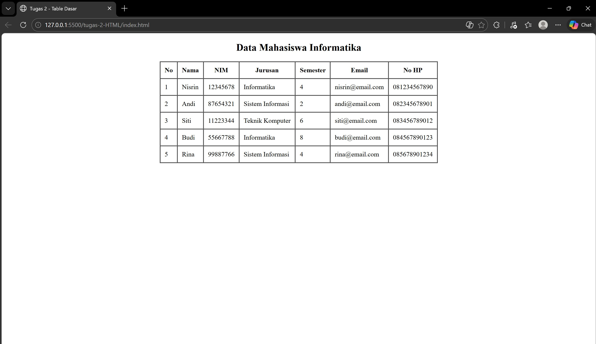

<div align="center">
  <br />
  <h1>LAPORAN PRAKTIKUM <br>APLIKASI BERBASIS PLATFORM</h1>
  <br />
  <h3>MODUL 2 <br> HTML </h3>
  <br />
   
  <br />
  <br />
  <br />
  <h3>Disusun Oleh :</h3>
  <p>
    <strong>Nisrina Amalia Iffatunnisa</strong><br>
    <strong>2311102156</strong><br>
    <strong>S1 IF-11-01</strong>
  </p>
  <br />
  <h3>Dosen Pengampu :</h3>
  <p>
    <strong>Dimas Fanny Hebrasianto Permadi, S.ST., M.Kom</strong>
  </p>
  <br />
  <br />
    <h4>Asisten Praktikum :</h4>
    <strong> Apri Pandu Wicaksono </strong> <br>
    <strong>Rangga Pradarrell Fathi</strong>
  <br />
  <h3>LABORATORIUM HIGH PERFORMANCE
 <br>FAKULTAS INFORMATIKA <br>UNIVERSITAS TELKOM PURWOKERTO <br>2026</h3>
</div>

---

## Dasar Teori
#### Pengenalan HTML
HTML atau HyperText Markup Language merupakan bahasa dasar yang digunakan untuk membangun sebuah web dimana HTML menangani elemen-elemen dasar pada pembangunan sebuah website. Struktur HTML paling dasar adalah sebagai berikut:</br>

a. Tag dalam HTML secara normal memiliki sepasang tag di mana tag pertama merupakan tag pembuka dan yang kedua merupakan tag penutup. Konten yang ingin ditampilkan pada laman web diletakkan di antara kedua tag tersebut. ```<nama_tag> letakkan konten di sini ... </nama_tag>```. Tag dalam HTML tidak semuanya berbentuk pasangan, ada beberapa tag yang hanya berdiri sendiri sepertitag ```<br/>``` yang berguna untuk berpindah baris.</br>
b. Elemen HTML merupakan tag HTML yang telah memiliki konten atau isi di antara kedua tag pembuka dan penutupnya. Elemen HTML dapat berupa teks atau juga dapat menyisipkan tag HTML lain pada elemen tersebut.</br>
c. Atribut HTML merupakan tambahan informasi dari sebuah tag HTML. Bentuk atribut untuk setiap tag HTML berbeda-beda sehingga kegunaan atribut juga berbeda seperti menambahkan informasi warna elemen, ukuran lebar, ukuran panjang dan lain-lain.</br>

### Dasar Sintaks HTML
Seperti yang sudah dijelaskan sebelumnya struktur dasar HTML antara lain berupa:
• Deklarasi ```<! DOCTYPE html>``` mendefinisikan dokumen menjadi HTML5 </br>
• Elemen ```<html>``` adalah elemen dasar dari halaman HTML </br>
• Elemen ```<head>``` berisi informasi meta tentang dokumen </br>
• Elemen ```<title>``` menentukan judul untuk dokumen </br>
• Elemen ```<body>``` berisi konten halaman yang terlihat </br>

a. Heading pada HTML merupakan tag yang berguna untuk menampilkan judul dari konten laman web yang dibangun. Heading dalam sebuah laman web berperan penting untuk aplikasi mesin pencarian karena sistem mesin pencarian bekerja dengan menggunakan Heading laman web kita sebagai index pencarian. Dalam HTML terdapat enam tingkatan Heading di mana semakin kecil nilai heading nya maka semakin penting dan semakin besar ukurannya pada laman web. </br>
b. Hyperlink dalam HTML memungkinkan halaman web berpindah laman atau bernavigasi menuju laman web yang lain. Tag yang digunakan adalah tag ```<a>...</a>```. Dalam tag Hyperlink pada HTML ada satu atribut yang harus digunakan agar konten yang ada di antara tag hyperlink berjalan dan dapat melakukan navigasi menuju laman web lain yaitu atribut href. Atribut ini bernilai url atau alamat dari laman web tujuan. </br>
c. Tabel pada HTML didefinisikan dengan tag ```<table></table>``` dengan setiap pendefinisian baris menggunakan tag ```<tr></tr>```, pendefinisian heading tabel menggunakan tag ```<th></th>``` dan pendefinisian kolom menggunakan tag ```<td></td>```. </br>
d. Image pada HTML yang digunakan adalah `````` tag ini tidak memiliki pasangan penutup maka dari itu diakhir tag pembuka ditambahkan garis miring seperti di atas. Terdapat satu atribut wajib yang harus ditambahkan seperti atribut href pada tag Hyperlink yaitu atribut src yang bernilai alamat direktori gambar disimpan.</br>
e. Audio/Visual Elemen, untuk audio menggunakan tag ``<audio>`` untuk tag pembuka dan `<source>` untuk memanggil url atau alamat direktori file. Sedangkan untuk video menggunakan tag `<video>`. </br>
f. Form pada HTML digunakan sebagai wadah untuk menampung dan mengumpulkan data-data dari pengguna jika diperlukan untuk disimpan dalam sebuah database. Tag dasar untuk pemanggilan form adalah `<form> ... </form>` dan diantara tag form tersebut merupakan tempat mendefinisikan elemenelemen yang dibutuhkan form yang akan dibuat nantinya. </br>


##  Unguided 

### 1. Implementasi Basic HTML

```HTML
<!DOCTYPE html>
<html>
<head>
    <title>Tugas 2 - Table Dasar</title>
</head>
<body>

<center>
    <h2>Data Mahasiswa Informatika</h2>

    <table border="1" cellpadding="10" cellspacing="0">
        <tr>
            <th>No</th>
            <th>Nama</th>
            <th>NIM</th>
            <th>Jurusan</th>
            <th>Semester</th>
            <th>Email</th>
            <th>No HP</th>
        </tr>

        <tr>
            <td>1</td>
            <td>Nisrin</td>
            <td>12345678</td>
            <td>Informatika</td>
            <td>4</td>
            <td>nisrin@email.com</td>
            <td>081234567890</td>
        </tr>

        <tr>
            <td>2</td>
            <td>Andi</td>
            <td>87654321</td>
            <td>Sistem Informasi</td>
            <td>2</td>
            <td>andi@email.com</td>
            <td>082345678901</td>
        </tr>

        <tr>
            <td>3</td>
            <td>Siti</td>
            <td>11223344</td>
            <td>Teknik Komputer</td>
            <td>6</td>
            <td>siti@email.com</td>
            <td>083456789012</td>
        </tr>

        <tr>
            <td>4</td>
            <td>Budi</td>
            <td>55667788</td>
            <td>Informatika</td>
            <td>8</td>
            <td>budi@email.com</td>
            <td>084567890123</td>
        </tr>

        <tr>
            <td>5</td>
            <td>Rina</td>
            <td>99887766</td>
            <td>Sistem Informasi</td>
            <td>4</td>
            <td>rina@email.com</td>
            <td>085678901234</td>
        </tr>

    </table>
</center>

</body>
</html>
```

Kode HTML di atas merupakan contoh pembuatan tabel dasar menggunakan elemen `<table>` tanpa bantuan CSS atau styling tambahan. Struktur dimulai dari deklarasi `<!DOCTYPE html>` yang menandakan dokumen menggunakan HTML5. Di dalam bagian `<body>`, digunakan tag `<center>` untuk memposisikan seluruh konten agar berada di tengah layar. Judul tabel ditampilkan menggunakan tag `<h2>`, kemudian dibuat tabel dengan atribut border, cellpadding, dan cellspacing untuk mengatur tampilan garis dan jarak antar sel secara langsung melalui atribut HTML.

Bagian tabel terdiri dari baris header (`<tr>` dengan `<th>`) yang berisi judul kolom seperti No, Nama, NIM, Jurusan, Semester, Email, dan No HP. Setelah itu terdapat beberapa baris data (`<tr>` dengan `<td>`) yang menampilkan informasi mahasiswa. Setiap `<tr>` merepresentasikan satu baris data, sedangkan `<td>` digunakan untuk mengisi isi sel pada tabel. Struktur ini menunjukkan penggunaan elemen tabel HTML secara dasar dan terorganisir. Secara keseluruhan, kode ini sudah memenuhi ketentuan untuk membuat tabel yang berada di tengah layar tanpa menggunakan CSS.

## SS Tugas


## Kesimpulan
Kesimpulannya, kode HTML tersebut berhasil menampilkan tabel data mahasiswa secara terstruktur dan berada di tengah layar tanpa menggunakan CSS atau styling tambahan. Pembuatan tabel dilakukan dengan memanfaatkan elemen dasar HTML seperti `<table>`, `<tr>`, `<th>`, dan `<td>`, serta atribut bawaan seperti border, cellpadding, dan cellspacing. Penggunaan tag `<center>` membantu memposisikan tabel agar tampil di tengah halaman. Secara keseluruhan, kode ini menunjukkan pemahaman dasar mengenai struktur dan pembuatan tabel dalam HTML murni.

## Referensi
[1] [Materi Modul 3 HTML](https://drive.google.com/file/d/1f-WJU1OaMIyZZZXtIissubHZ9fdcUO8y/view) </br>
