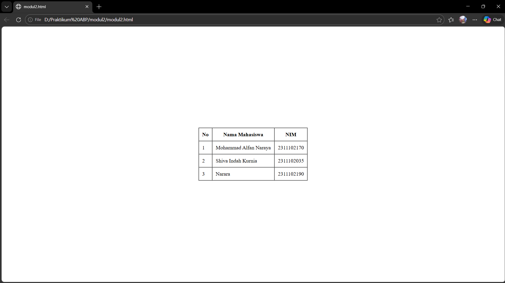

<div align="center">
  <br />
  <h1>LAPORAN PRAKTIKUM <br>APLIKASI BERBASIS PLATFORM</h1>
  <br />
  <h3>MODUL 2 <br> HTML</h3>
  <br />
  <br />
   
  <br />
  <br />
  <br />
  <h3>Disusun Oleh :</h3>
  <p>
    <strong>Mohammad Alfan Naraya</strong><br>
    <strong>2311102170</strong><br>
    <strong>S1 IF-11-01</strong>
  </p>
  <br />
  <h3>Dosen Pengampu :</h3>
  <p>
    <strong>Dimas Fanny Hebrasianto Permadi, S.ST., M.Kom</strong>
  </p>
  <br />
  <br />
    <h4>Asisten Praktikum :</h4>
    <strong> Apri Pandu Wicaksono </strong> <br>
    <strong>Rangga Pradarrell Fathi</strong>
  <br />
  <h3>LABORATORIUM HIGH PERFORMANCE
 <br>FAKULTAS INFORMATIKA <br>UNIVERSITAS TELKOM PURWOKERTO <br>2026</h3>
</div>

---

## 1. Dasar Teori

HTML (HyperText Markup Language) merupakan bahasa markah standar yang digunakan untuk membangun struktur dasar sebuah halaman web. HTML bekerja dengan menggunakan kumpulan tag atau elemen yang tersusun secara bertingkat (*nested elements*). Tag tersebut memberikan instruksi kepada *web browser* mengenai bagaimana konten seperti teks, gambar, maupun elemen lainnya ditampilkan pada halaman web.

Salah satu fitur yang tersedia pada HTML adalah pembuatan tabel. Tabel dapat dibuat langsung menggunakan elemen HTML tanpa harus menggunakan bantuan CSS (Cascading Style Sheets). Dalam struktur tabel HTML terdapat beberapa elemen utama, antara lain:

- `<table>` digunakan sebagai pembungkus utama tabel
- `<tr>` digunakan untuk menandai baris tabel
- `<th>` digunakan sebagai sel header tabel
- `<td>` digunakan sebagai sel data tabel

Selain itu, HTML juga menyediakan beberapa atribut yang memungkinkan penggabungan sel dalam tabel, yaitu:

- `rowspan` digunakan untuk menggabungkan beberapa baris
- `colspan` digunakan untuk menggabungkan beberapa kolom

Pada HTML versi lama juga terdapat beberapa atribut presentasi seperti `border`, `cellpadding`, dan `cellspacing` yang digunakan untuk mengatur tampilan tabel secara langsung. Selain itu, tag `<center>` dapat digunakan untuk menempatkan elemen pada posisi tengah halaman. Namun pada pengembangan web modern, pengaturan tampilan biasanya dilakukan menggunakan CSS.

---

## 2. Penjelasan Kode HTML

Berikut ini adalah implementasi tabel berdasarkan struktur dasar HTML murni beserta hasil tampilannya.

### Kode HTML (`table.html`)

```html
<center>
    <table border="0" width="100%" height="100%">
        <tr>
            <td align="center" valign="middle">
                
                <table border="1" cellpadding="10" cellspacing="0">
                    <thead>
                        <tr>
                            <th>No</th>
                            <th>Nama Mahasiswa</th>
                            <th>NIM</th>
                        </tr>
                    </thead>
                    <tbody>
                        <tr>
                            <td>1</td>
                            <td>Mohammad Alfan Naraya</td>
                            <td>2311102170</td>
                        </tr>
                        <tr>
                            <td>2</td>
                            <td>Shiva Indah Kurnia</td>
                            <td>2311102035</td>
                        </tr>
                        <tr>
                            <td>3</td>
                            <td>Narara</td>
                            <td>2311102190</td>
                        </tr>
                    </tbody>
                </table>
                </td>
        </tr>
    </table>
</center>
```

### Hasil Tampilan (Screenshot)



### Penjelasan Code

- **Baris 1-32** menggunakan tag pembungkus <center> dan tabel bantuan dengan atribut height="100%" yang berfungsi untuk menempatkan seluruh elemen tabel tepat pada posisi tengah halaman, baik secara horizontal maupun vertikal. Dengan penggunaan teknik ini, tabel akan otomatis ditampilkan di tengah layar browser tanpa perlu tambahan pengaturan menggunakan CSS.

- **Baris 7** menggunakan beberapa atribut pada tag <table>, yaitu border="1", cellpadding="10", dan cellspacing="0".
  - `border` berfungsi menampilkan garis batas tabel dengan ketebalan 1 piksel agar struktur kolom dan baris terlihat jelas. 
  - `cellpadding` memberikan jarak antara isi sel dengan garis batas sel sebesar 10 piksel agar teks tidak menempel pada garis.
  - `cellspacing` digunakan untuk menghilangkan jarak antar sel sehingga tampilan garis tabel terlihat menyatu dan lebih rapi.

- **Baris 9-13** menggunakan elemen `<th>` sebagai header tabel yang mendefinisikan judul kolom seperti NO, Nama Mahasiswa, dan NIM. 
    Tag `<th>` secara otomatis memberikan efek cetak tebal dan perataan tengah pada teks di dalamnya untuk membedakan antara judul dan isi data.

- **Baris 16–27** berisi data tabel yang ditulis menggunakan elemen `<td>`. Setiap baris data dibungkus oleh tag `<tr>` yang menandakan satu baris tabel. Di dalam setiap baris tersebut terdapat informasi spesifik mahasiswa (seperti nomor urut, nama lengkap, dan NIM) yang ditampilkan sejajar sesuai dengan kolom yang telah ditentukan pada bagian header.

## Refrensi

- [Materi Modul 2](https://drive.google.com/file/d/1Gcsi-U4rzqU0GC6dYTlzO7KUthrGoL8q/view?usp=sharing)
