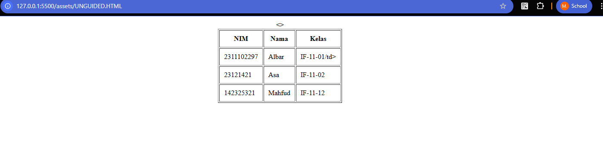

<div align="center">
  <br />
  <h1>LAPORAN PRAKTIKUM <br>ALGORITMA PEMROGRAMAN</h1>
  <br />
  <h3>MODUL 2 <br> HTML</h3>
  <br />
  <br />
   
  <br />
  <br />
  <br />
  <h3>Disusun Oleh :</h3>
  <p>
    <strong>M. Faleno Albar Firjatulloh</strong><br>
    <strong>2311102297</strong><br>
    <strong>S1 IF-11-01</strong>
  </p>
  <br />
  <h3>Dosen Pengampu :</h3>
  <p>
    <strong>Dimas Fanny Hebrasianto Permadi, S.ST., M.Kom</strong>
  </p>
  <br />
  <br />
    <h4>Asisten Praktikum :</h4>
    <strong> Apri Pandu Wicaksono </strong> <br>
    <strong>Rangga Pradarrell Fathi</strong>
  <br />
  <h3>LABORATORIUM HIGH PERFORMANCE
 <br>FAKULTAS INFORMATIKA <br>UNIVERSITAS TELKOM PURWOKERTO <br>2026</h3>
</div>

---

## 1. Dasar Teori

HTML (*HyperText Markup Language*) adalah bahasa standar untuk menyusun kerangka sebuah halaman web[cite: 15].Ia bekerja melalui sistem elemen atau tag yang saling bersarang (*nested*), memberikan instruksi kepada browser tentang bagaimana konten harus ditampilkan[cite: 16].

Salah satu kemampuan dasar HTML adalah membuat tabel secara langsung menggunakan elemen-elemen berikut[cite: 18]:
* `<table>`: Kontainer utama yang membungkus seluruh struktur tabel[cite: 19].
*`<tr>` (*Table Row*): Menentukan baris di dalam tabel[cite: 20].
*`<th>` (*Table Header*): Sel khusus untuk judul kolom atau baris (biasanya tercetak tebal)[cite: 21].
*`<td>` (*Table Data*): Sel standar yang berisi data atau konten tabel[cite: 22].

Untuk tata letak yang lebih kompleks, HTML menyediakan atribut untuk menggabungkan sel yaitu `colspan` untuk menggabungkan kolom secara horizontal dan `rowspan` untuk menggabungkan baris secara vertikal[cite: 24, 25, 26].

---

## 2. Penjelasan Kode HTML (Unguided)

Berikut adalah implementasi tabel data mahasiswa menggunakan teknik *nested table* sesuai dengan tugas praktikum.

### Kode HTML (`unguided.html`)

```html
<!DOCTYPE html>
<html lang="en">
<head>
    <title>2311102297 M. Faleno Albar Firjatulloh</title>
</head>
<body>
    <table width="100%" valign="top">
        <tr>
            <td align="center" valign="middle">
                <table border="1" cellpadding="10">
                    <tr>
                        <th>NIM</th>
                        <th>Nama</th>
                        <th>Kelas</th>
                    </tr>
                    <tr>
                        <td>2311102297</td>
                        <td>Albar</td>
                        <td>IF-11-01</td>
                    </tr>
                    <tr>
                        <td>23121421</td>
                        <td>Asa</td>
                        <td>IF-11-02</td>
                    </tr>
                    <tr>
                        <td>142325321</td>
                        <td>Mahfud</td>
                        <td>IF-11-12</td>
                    </tr>
                </table>
            </td>
        </tr>
    </table>
</body>
</html>

```

### Hasil Tampilan (Screenshot)



### Penjelasan Code
### Pengaturan Tata Letak (Centering)

Kode ini menggunakan teknik **nested table** (tabel di dalam tabel) untuk menempatkan konten di tengah halaman.

- **Tabel Luar**  
  Berfungsi sebagai kontainer utama dengan lebar **100%** untuk mengatur posisi elemen di dalamnya.

- **Atribut `align="center"`**  
  Digunakan agar tabel utama yang berisi data berada tepat di tengah halaman secara horizontal.

---

### Struktur Tabel

Struktur tabel dibangun menggunakan beberapa elemen HTML berikut:

- **`<table>`**  
  Digunakan untuk membuat area tabel. Properti seperti **border** dan **cellpadding** digunakan agar tabel memiliki garis tepi serta jarak antara teks dan batas sel.

- **`<tr>` (Table Row)**  
  Digunakan untuk membuat baris pada tabel.  
  Terdapat **4 baris**, yaitu:
  - 1 baris untuk **judul kolom (header)**
  - 3 baris untuk **data mahasiswa**

- **`<td>` (Table Data)**  
  Digunakan untuk menampilkan isi data pada setiap sel tabel yang berisi informasi masing-masing mahasiswa.

---
 ## Refrensi

- [Materi Modul 2](https://drive.google.com/file/d/1Gcsi-U4rzqU0GC6dYTlzO7KUthrGoL8q/view?usp=sharing)