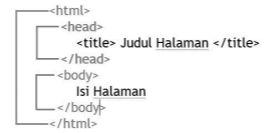
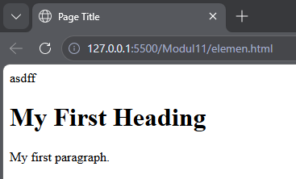
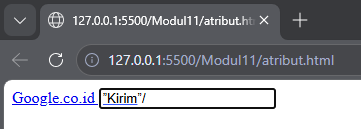
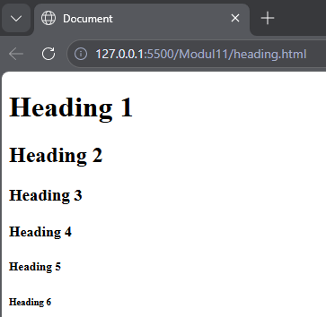
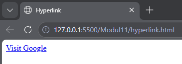
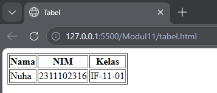
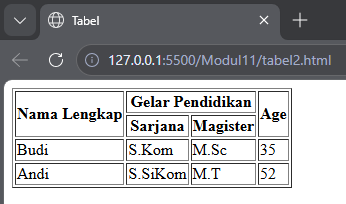
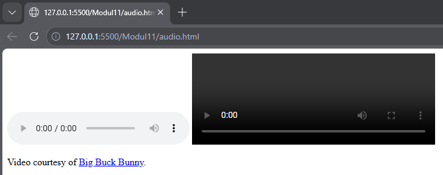
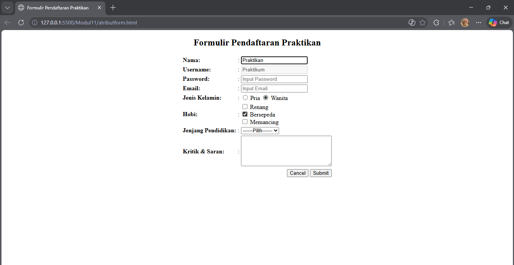
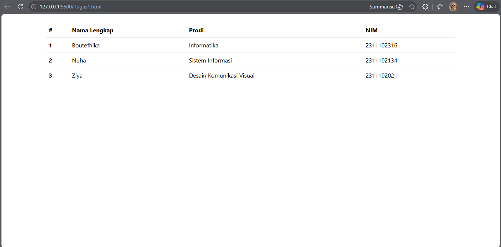

<div align="center">
  <br />

  <h1>LAPORAN PRAKTIKUM <br>
  APLIKASI BERBASIS PLATFORM
  </h1>

  <br />

  <h3>MODUL 2 <br>
  HTML
  </h3>

  <br />

  


  <br />
  <br />
  <br />

  <h3>Disusun Oleh :</h3>

  <p>
    <strong>Boutefhika Nuha Ziyadatul Khair</strong><br>
    <strong>2311102316</strong><br>
    <strong>S1 IF-11-01</strong>
  </p>

  <br />

  <h3>Dosen Pengampu :</h3>

  <p>
    <strong>Dimas Fanny Hebrasianto Permadi, S.ST., M.Kom</strong>
  </p>
  
  <br />
  <br />
    <h4>Asisten Praktikum :</h4>
    <strong>Apri Pandu Wicaksono </strong> <br>
    <strong>Rangga Pradarrell Fathi</strong>
  <br />

  <h3>LABORATORIUM HIGH PERFORMANCE
 <br>FAKULTAS INFORMATIKA <br>UNIVERSITAS TELKOM PURWOKERTO <br>2026</h3>
</div>

<hr>


# Dasar Teori

## 3.1. Pengennalan HTML
HTML atau HyperText Markup Language merupakan bahasa dasar yang digunakan untuk membangun
sebuah web dimana HTML menangani elemen-elemen dasar pada pembangunan sebuah website. Struktur
HTML paling dasar adalah sebagai berikut:


### 3.1.1. Tag HTML
Tag dalam HTML secara normal memiliki sepasang tag di mana tag pertama merupakan tag pembuka dan
yang kedua merupakan tag penutup. Konten yang ingin ditampilkan pada laman web diletakkan di antara kedua tag tersebut.

<p align="center"><nama_tag> letakkan konten di sini ... </nama_tag></p>

Tag dalam HTML tidak semuanya berbentuk pasangan, ada beberapa tag yang hanya berdiri sendiri seperti tag “<br/>” yang berguna untuk berpindah baris.

### 3.1.2. Elemen HTML
Elemen HTML merupakan tag HTML yang telah memiliki konten atau isi di antara kedua tag pembuka danpenutupnya. Elemen HTML dapat berupa teks atau juga dapat menyisipkan tag HTML lain pada elemen tersebut.
```
<!DOCTYPE html>
<html>

<head>
  <!-- Contoh elemen berisi tag lain -->
  <title>Page Title</title>
</head> asdff

<body>
  <h1>My First Heading</h1>
  <!-- Contoh Elemen berisi Teks -->
  <p>My first paragraph.</p>
</body>
</html>
```


### 3.1.3. Atribut HTML
Atribut HTML merupakan tambahan informasi dari sebuah tag HTML. Bentuk atribut untuk setiap tag HTML berbeda-beda sehingga kegunaan atribut juga berbeda seperti menambahkan informasi warna elemen, ukuran lebar, ukuran panjang dan lain-lain. Namun, mayoritas atribut yang sering muncul untuk setiap tag HTML adalah atribut “id” dan “class” karena kedua atribut ini berperan besar dalam pengembangan laman web dengan CSS dan JavaScript. Atribut HTML dideklarasikan di dalam tag pembuka pada setiap elemen HTML dengan format nama_atribut=”value”, setiap nilai atribut diapit oleh petik dua.
```
<a href=”www.google.co.id” > Google.co.id </a>
<input type=”button” id=”btnSubmit” class=”btnSubmit1” value=”Kirim”/>
```


## 3.2. Dasar Sintaks HTML
```
<!DOCTYPE html>
<html>

<head>
  <title>Page Title</title>
</head>

<body>
  <h1>My First Heading</h1>
  <p>My first paragraph.</p>
</body>

</html>
```
Seperti yang sudah dijelaskan sebelumnya struktur dasar HTML antara lain berupa:
• Deklarasi <! DOCTYPE html> mendefinisikan dokumen menjadi HTML5
• Elemen <html> adalah elemen dasar dari halaman HTML
• Elemen <head> berisi informasi meta tentang dokumen
• Elemen <title> menentukan judul untuk dokumen
• Elemen <body> berisi konten halaman yang terlihat

## 3.3. Heading
Heading pada HTML merupakan tag yang berguna untuk menampilkan judul dari konten laman web yang
dibangun. Heading dalam sebuah laman web berperan penting untuk aplikasi mesin pencarian karena
sistem mesin pencarian bekerja dengan menggunakan Heading laman web kita sebagai index pencarian. Dalam HTML terdapat enam tingkatan Heading di mana semakin kecil nilai heading nya maka semakin penting dan semakin besar ukurannya pada laman web.
```
<h1>Heading 1</h1>
<h2>Heading 2</h2>
<h3>Heading 3</h3>
<h4>Heading 4</h4>
<h5>Heading 5</h5>
<h6>Heading 6</h6>
```


## 3.4. Hyperlink
Hyperlink dalam HTML memungkinkan halaman web berpindah laman atau bernavigasi menuju laman web
yang lain. Tag yang digunakan adalah tag <a>...</a>
```
<a href="www.google.co.id"> Visit Google </a>
```
output:



Dalam tag Hyperlink pada HTML ada satu atribut yang harus digunakan agar konten yang ada di antara tag hyperlink berjalan dan dapat melakukan navigasi menuju laman web lain yaitu atribut href. Atribut ini bernilai url atau alamat dari laman web tujuan.

## 3.5. Tabel
Tabel pada HTML merupakan salah satu elemen penting khususnya digunakan untuk menampilkan data
yang membutuhkan bentuk tabel. Tabel pada HTML didefinisikan dengan tag <table></table> dengan setiap pendefinisian baris menggunakan tag <tr></tr>, pendefinisian heading tabel menggunakan tag <th></th> dan pendefinisian kolom menggunakan tag <td></td>.
```
<html>
    <head>
        <title>Tabel</title>
    </head>
    <body>
        <table width=”80%” height=”50%” border="1"> 
            <tr> 
                <th>Nama</th> 
                <th>NIM</th> 
                <th>Kelas</th> 
            </tr> 
            <tr> 
                <td>Nuha</td> 
                <td>2311102316</td> 
                <td>IF-11-01</td> 
            </tr> 
            </table> 
    </body>
</html>
```



Dalam tabel HTML kita dapat melakukan operasi Merge Cell yang biasanya dapat dilakukan pada aplikasi perkantoran seperti Microsoft Word atau Excel dengan cara menambahkan atribut colspan dan rowspan pada tag pembuka kolom yaitu <td> nilai dari atribut tersebut berupa jumlah kolom atau baris yang akan digabungkan.
  
```
<html>
    <head>
        <title>Tabel</title>
    </head>
    <body>
        <table width=”80%” height=”50%” border="1"> 
            <tr> 
                <th rowspan="2">Nama Lengkap</th> 
                <th colspan="2">Gelar Pendidikan</th> 
                <th rowspan="2">Age</th> 
            </tr> 
            <tr> 
                <th> Sarjana </th> 
                <th> Magister </th> 
            </tr> 
            <tr> 
                <td>Budi</td> 
                <td>S.Kom</td> 
                <td>M.Sc</td> 
                <td>35</td> 
            </tr> 
            <tr> 
                <td>Andi</td> 
                <td>S.SiKom</td> 
                <td>M.T</td> 
                <td>52</td> 
            </tr> 
            </table> 
    </body>
</html>
```


## 3.6. Image
Menampilkan gambar pada halaman web merupakan sebuah improvisasi dalam pembuatan desain sebuah
web yang dapat memperindah tampilan website. Tag HTML yang digunakan adalah  tag ini tidak
memiliki pasangan penutup maka dari itu diakhir tag pembuka ditambahkan garis miring seperti di atas. Terdapat satu atribut wajib yang harus ditambahkan seperti atribut href pada tag Hyperlink yaitu atribut src yang bernilai alamat direktori gambar disimpan.
```

<p>Kucing Aku</p>
```


## 3.7. Audio/ Video Elemen
Sebelum berkembangnya teknologi HTML5, untuk menyisipkan audio atau video, diperlukan sebuah plugin seperti Flash Player namun sekarang dengan HTML5 memiliki tag yang dapat menyisipkan audio atau video ke dalam laman web. Untuk audio menggunakan tag <audio> untuk tag pembuka dan <source> untuk memanggil url atau alamat direktori file. Sedangkan untuk video menggunakan tag <video>.
```
<audio controls>
    <source src="lagu.ogg" type="audio/ogg">
    <source src="lagu.mp3" type="audio/mpeg"> Your browser does not support the audio
    element.
</audio>
<video width="400" controls>
    <source src="task.mp4" type="video/mp4">
    <source src="task.ogg" type="video/ogg"> Your browser does not support HTML5
    video.
</video>
<p>
    Video courtesy of
    <a href="https://www.bigbuckbunny.org/" target="_blank">Big Buck Bunny</a>.
</p>
```


## 3.8. Form
Form pada HTML digunakan sebagai wadah untuk menampung dan mengumpulkan data-data dari
pengguna jika diperlukan untuk disimpan dalam sebuah database. Tag dasar untuk pemanggilan
form adalah <form> ... </form> dan diantara tag form tersebut merupakan tempat mendefinisikan
elemenelemen yang dibutuhkan form yang akan dibuat nantinya. Atribut utama dari tag form yaitu
action, atribut ini bernilai tujuan data akan diolah dengan bahasa pemrograman web saat tombol
“Submit” ditekan, selain itu atribut method yang hanya bernilai POST atau GET ini juga sangat dibutuhkan untuk pengolahan data dengan bahasa pemrograman web. Pembahasan lebih lanjut ada pada modul PHP.

### 3.8.1. Elemen Form
Elemen-elemen form pada html adalah sebagai berikut:
| Tag | Type | Fungsionalitas |
|-----|------|----------------|
| `<input/>` | `type="text"` | Menampilkan elemen untuk input data teks |
| `<input/>` | `type="password"` | Menampilkan elemen untuk input data password |
| `<input/>` | `type="email"` | Menampilkan elemen untuk input data email |
| `<input/>` | `type="radio"` | Menampilkan elemen untuk pemilihan data berbentuk radio |
| `<input/>` | `type="checkbox"` | Menampilkan elemen untuk pemilihan data berbentuk checkbox |
| `<input/>` | `type="submit"` | Menampilkan elemen tombol untuk pengolahan data form |
| `<select> <option> ... </option> </select>` | - | Menampilkan elemen untuk pemilihan data berbentuk dropdown list |
| `<textarea> ... </textarea>` | - | Menampilkan elemen untuk input data dalam bentuk paragraf panjang |
| `<button> ... </button>` | `type="button"` | Menampilkan elemen tombol |

### 3.8.2. Atribut Elemen Form
Atribut-atribut elemen form yang sering digunakan antara lain sebagai berikut:
| Atribut | Value | Fungsionalitas |
|--------|-------|----------------|
| `id` | Bebas | Menambahkan informasi ID dari elemen untuk kebutuhan CSS, JavaScript atau bahasa pemrograman web lainnya |
| `name` | Bebas | Menambahkan informasi Name dari elemen untuk kebutuhan JavaScript atau bahasa pemrograman web lainnya |
| `class` | Bebas | Menambahkan informasi Class dari elemen untuk kebutuhan CSS, JavaScript atau bahasa pemrograman web lainnya |
| `placeholder` | Bebas | Menampilkan informasi sementara tentang elemen sebelum pengguna memberikan input |
| `value` | Bebas | Memberikan nilai default pada elemen, khususnya pada elemen `input` dan `option` |
| `disabled` | - | Membuat elemen menjadi tidak dapat dioperasikan |
| `readonly` | - | Membuat elemen `input` tidak dapat diubah atau diberi input |
| `checked` | - | Membuat elemen `checkbox` atau `radio button` terpilih secara default |
| `selected` | - | Membuat elemen `option` pada tag `select` terpilih secara default |

```
<!DOCTYPE html>
<html lang="id">
<head>
    <meta charset="UTF-8">
    <meta name="viewport" content="width=device-width, initial-scale=1.0">
    <title>Formulir Pendaftaran Praktikan</title>
</head>

<body>
    <center>
        <h2>Formulir Pendaftaran Praktikan</h2>

        <form action="#" method="POST">
            <table>
                <tr>
                    <td><label for="nama_id"><b>Nama:</b></label></td>
                    <td>:</td>
                    <td>
                        <input type="text" name="nama_input" id="nama_id"
                        placeholder="Input Nama" value="Praktikan" readonly>
                    </td>
                </tr>

                <tr>
                    <td><label for="uname_id"><b>Username:</b></label></td>
                    <td>:</td>
                    <td>
                        <input type="text" name="uname_input" id="uname_id"
                        placeholder="Input Username" value="Praktikum" disabled>
                    </td>
                </tr>

                <tr>
                    <td><label for="password_id"><b>Password:</b></label></td>
                    <td>:</td>
                    <td>
                        <input type="password" name="password_input" id="password_id"
                        placeholder="Input Password">
                    </td>
                </tr>

                <tr>
                    <td><label for="email_id"><b>Email:</b></label></td>
                    <td>:</td>
                    <td>
                        <input type="email" name="email_input" id="email_id"
                        placeholder="Input Email">
                    </td>
                </tr>

                <tr>
                    <td><b>Jenis Kelamin:</b></td>
                    <td>:</td>
                    <td>
                        <input type="radio" name="jk_input" id="pria" value="Pria">
                        <label for="pria">Pria</label>

                        <input type="radio" name="jk_input" id="wanita" value="Wanita">
                        <label for="wanita">Wanita</label>
                    </td>
                </tr>

                <tr>
                    <td><b>Hobi:</b></td>
                    <td>:</td>
                    <td>
                        <input type="checkbox" name="hobi_input" id="renang" value="Renang">
                        <label for="renang">Renang</label><br>

                        <input type="checkbox" name="hobi_input" id="bersepeda" value="Bersepeda">
                        <label for="bersepeda">Bersepeda</label><br>

                        <input type="checkbox" name="hobi_input" id="memancing" value="Memancing">
                        <label for="memancing">Memancing</label>
                    </td>
                </tr>

                <tr>
                    <td><label for="jp_id"><b>Jenjang Pendidikan:</b></label></td>
                    <td>:</td>
                    <td>
                        <select name="jp_input" id="jp_id">
                            <option value="" selected>------Pilih------</option>
                            <option value="D3">Tamat D3</option>
                            <option value="S1">Tamat S1</option>
                            <option value="S2">Tamat S2</option>
                            <option value="S3">Tamat S3</option>
                        </select>
                    </td>
                </tr>

                <tr>
                    <td><label for="kritik_saran"><b>Kritik & Saran:</b></label></td>
                    <td>:</td>
                    <td>
                        <textarea id="kritik_saran" name="kritik_saran" rows="5" cols="30"></textarea>
                    </td>
                </tr>

                <tr>
                    <td colspan="3" align="right">
                        <input type="button" value="Cancel" class="btn-cancel">
                        <input type="submit" value="Submit" class="btn-submit">
                    </td>
                </tr>
        </form>

    </center>
</body>
</html>
```



# UNGUIDED (Buat tampilan table dasar namun harus di tengah layar/center dan tidak boleh menggunakan css atau styling atau apapun itu.)
```
<!DOCTYPE html>
<html lang="en">
<head>
    <meta charset="UTF-8">
    <meta name="viewport" content="width=device-width, initial-scale=1.0">
    <title>Tabel Hover Bootstrap</title>
    <link rel="stylesheet" href="https://cdn.jsdelivr.net/npm/bootstrap@5.3.6/dist/css/bootstrap.min.css">
</head>

<body>

<div class="container mt-4">

<table class="table table-hover">
    <thead>
        <tr>
            <th scope="col">#</th>
            <th scope="col">Nama Lengkap</th>
            <th scope="col">Asal Kota</th>
            <th scope="col">Umur</th>
        </tr>
    </thead>

    <tbody>
        <tr>
            <th scope="row">1</th>
            <td>Budi Rojadi</td>
            <td>Semarang</td>
            <td>35 th</td>
        </tr>

        <tr>
            <th scope="row">2</th>
            <td>Yulia Santi</td>
            <td>Bekasi</td>
            <td>32 th</td>
        </tr>

        <tr>
            <th scope="row">3</th>
            <td>Fahri Abdilah</td>
            <td>Medan</td>
            <td>38 th</td>
        </tr>
    </tbody>
</table>

</div>

</body>
</html>
```
Output:

